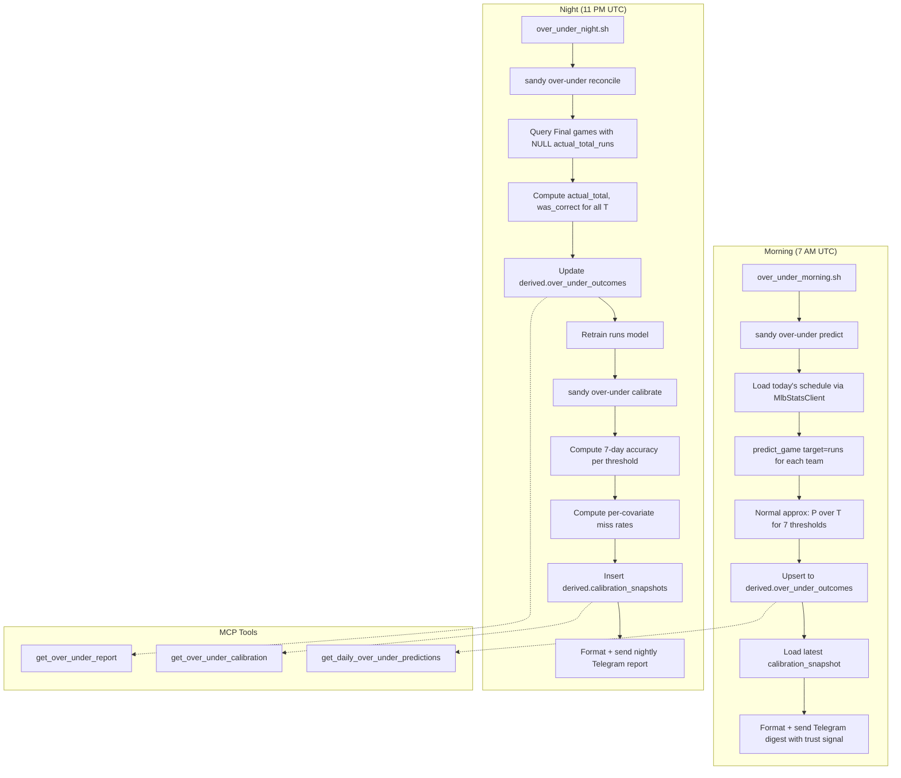

# Design Document: Sandy Over/Under Feedback Loop

## Overview

The Sandy Over/Under Feedback Loop adds a daily prediction → reconciliation → calibration → retraining cycle for MLB game total runs over/under betting. It builds on the existing `predict_game` / `runs` model, the `evaluation.reconciler`, and the Telegram notification pattern from `daily_refresh.sh`.

The system operates in three phases each day:
1. **Morning (7 AM UTC)**: Predict P(total > T) for all scheduled games, persist to DB, send Telegram digest with trust signal from latest calibration.
2. **Night (11 PM UTC)**: Reconcile final scores, compute was_correct for each threshold, retrain the runs model with all available data, compute daily calibration, send nightly report.
3. **Weekly (Sunday 11:30 PM UTC)**: Deeper covariate EDA report with rolling 4-week accuracy trends.

All new code lives in a `sandy/over_under/` package. Three new MCP tools expose predictions, reports, and calibration on-demand. Three new CLI commands (`sandy over-under predict/reconcile/calibrate`) enable manual execution.

---

## Architecture



### Key Design Decisions

1. **Same infrastructure**: Runs on the existing EC2 instance, same Postgres database, same Python package. No new services.
2. **Reuses existing modules**: `predict_game(target="runs")` for expected runs, `MlbStatsClient` (via `schedule.client`) for schedule, `daily_refresh.sh` Telegram pattern for notifications.
3. **Normal approximation for over/under**: Uses `scipy.stats.norm.cdf` with σ=2.8 (MLB game total residual std), matching the existing `_handle_predict_total_runs` implementation.
4. **Daily retraining with guard**: Model retrained every night after reconciliation. A 20% MAE degradation guard prevents bad models from being deployed.
5. **Feature vectors saved alongside predictions**: Enables post-hoc EDA without re-computing features.
6. **Idempotent operations**: Both prediction (upsert on game_pk+game_date) and reconciliation (skip already-filled rows) are safe to re-run.

---

## Components and Interfaces

### Module Layout

```
sandy/over_under/
├── __init__.py
├── predictor.py        # OverUnderPredictor: compute P(over T), format rows
├── reconciler.py       # OverUnderReconciler: fill actuals, compute was_correct
├── calibrator.py       # CalibrationAnalyzer: accuracy, miss rates, optimal T
├── retrainer.py        # DailyRetrainer: retrain runs model with guard
├── notifier.py         # Telegram message formatting helpers
└── schemas.py          # Dataclasses for over/under domain objects

sandy/cli/over_under_cmd.py   # Click group: sandy over-under predict/reconcile/calibrate
sandy/mcp/over_under_tools.py # MCP tool definitions + handlers

sandy/scripts/over_under_morning.sh
sandy/scripts/over_under_night.sh
sandy/scripts/over_under_weekly.sh

sandy/migrations/add_over_under_tables.sql
```

### Component Interfaces

#### `sandy/over_under/predictor.py`

```python
@dataclass(frozen=True)
class OverUnderPrediction:
    game_pk: int
    game_date: date
    home_team_code: str
    away_team_code: str
    game_time_utc: datetime
    predicted_at_utc: datetime
    p_over: dict[float, float]  # {5.5: 0.82, 6.5: 0.71, ...}
    feature_vector: dict[str, float]  # 10 GAME_FEATURE_NAMES keys
    home_starter_era: float
    away_starter_era: float
    ballpark_id: int
    home_trailing15_rpg: float
    away_trailing15_rpg: float
    pitcher_fallback: bool

def compute_over_under_probabilities(
    total_expected_runs: float,
    residual_std: float = 2.8,
) -> dict[float, float]:
    """Compute P(total > T) for all standard thresholds via normal CDF.
    
    Returns dict mapping threshold -> probability_over.
    Probabilities are monotonically decreasing as threshold increases.
    """

def predict_all_games(config: Config, game_date: date | None = None) -> list[OverUnderPrediction]:
    """Run over/under predictions for all games on the given date.
    
    Uses predict_game(target="runs") for each team, sums expected runs,
    then applies normal approximation for each threshold.
    Falls back to team season ERA when no probable pitcher is announced.
    """

def persist_predictions(engine: Engine, predictions: list[OverUnderPrediction]) -> int:
    """Upsert predictions to derived.over_under_outcomes. Returns row count."""
```

#### `sandy/over_under/reconciler.py`

```python
def reconcile_over_under(engine: Engine) -> int:
    """Fill actual outcomes for all Final games with NULL actual_total_runs.
    
    Computes:
    - actual_total_runs = home_score + away_score
    - actual_over_T = actual_total_runs > T (for each threshold)
    - was_correct_T = (p_over_T >= 0.5) == actual_over_T
    
    Returns number of rows updated. Idempotent.
    """
```

#### `sandy/over_under/calibrator.py`

```python
@dataclass(frozen=True)
class CalibrationSnapshot:
    snapshot_date: date
    accuracy_by_threshold: dict[float, float]  # {5.5: 0.68, 6.5: 0.71, ...}
    recommended_threshold: float
    sample_size: int
    covariate_insights: dict[str, Any]  # miss rates by covariate quartile
    rolling_4w_accuracy: float | None

def compute_calibration(engine: Engine, lookback_days: int = 7) -> CalibrationSnapshot | None:
    """Compute calibration metrics from recent reconciled outcomes.
    
    Returns None if fewer than 5 reconciled predictions exist.
    Identifies optimal threshold (highest accuracy over lookback window).
    Computes per-covariate miss rates grouped by quartile.
    """

def persist_calibration(engine: Engine, snapshot: CalibrationSnapshot) -> None:
    """Insert calibration snapshot to derived.calibration_snapshots."""
```

#### `sandy/over_under/retrainer.py`

```python
@dataclass(frozen=True)
class RetrainingResult:
    success: bool
    sample_size: int
    new_mae: float
    previous_mae: float | None
    skipped_reason: str | None  # Non-None if guard triggered

def retrain_runs_model(config: Config) -> RetrainingResult:
    """Retrain the runs model using all available game data.
    
    Uses the existing train_runs_model() function with standard LightGBM config.
    Compares new model's validation MAE against current artifact.
    If new MAE > old MAE * 1.2, does NOT overwrite (guard condition).
    """
```

#### `sandy/over_under/notifier.py`

```python
def format_morning_digest(
    predictions: list[OverUnderPrediction],
    calibration: CalibrationSnapshot | None,
) -> str:
    """Format the morning Telegram message.
    
    Includes:
    - Trust signal from latest calibration (or "insufficient data" note)
    - One line per game: HOMEvAWAY P(over 6.5)=XX%, sorted by game_time_utc
    """

def format_nightly_report(
    outcomes: list[dict],  # reconciled rows from DB
    calibration: CalibrationSnapshot | None,
    retraining: RetrainingResult | None,
) -> str:
    """Format the nightly Telegram message.
    
    Includes:
    - "Tonight's over/under (6.5): X/Y correct"
    - Per-game line with probability, actual total, ✅/❌, top-3 features
    - Calibration one-liner
    - Model retraining result
    """

def format_no_games_message() -> str:
    """Returns 'No games scheduled today — no over/under predictions.'"""

def format_no_finals_message() -> str:
    """Returns 'No final scores yet for today's predictions — will retry tomorrow.'"""

def send_telegram(message: str) -> bool:
    """Send message via Telegram bot API. Returns True on success.
    
    Uses TELEGRAM_BOT_TOKEN and TELEGRAM_CHAT_ID from environment.
    Matches the pattern in daily_refresh.sh (curl to sendMessage endpoint).
    """
```

#### `sandy/mcp/over_under_tools.py`

```python
# Three new tool definitions added to TOOL_DEFINITIONS in sandy/mcp/tools.py:
# - get_daily_over_under_predictions
# - get_over_under_report  
# - get_over_under_calibration

def handle_get_daily_over_under_predictions(args: dict) -> dict:
    """Return today's (or specified date's) predictions sorted by p_over_6_5 desc."""

def handle_get_over_under_report(args: dict) -> dict:
    """Return reconciled outcomes for yesterday (or specified date) with summary."""

def handle_get_over_under_calibration(args: dict) -> dict:
    """Return latest calibration snapshot with optional weeks_back history."""
```

#### `sandy/cli/over_under_cmd.py`

```python
@click.group("over-under")
def over_under():
    """Over/under prediction feedback loop commands."""

@over_under.command("predict")
@click.option("--date", type=str, default=None)
@click.option("--notify", is_flag=True)
def predict_cmd(date, notify): ...

@over_under.command("reconcile")
@click.option("--date", type=str, default=None)
@click.option("--notify", is_flag=True)
def reconcile_cmd(date, notify): ...

@over_under.command("calibrate")
@click.option("--notify", is_flag=True)
def calibrate_cmd(notify): ...
```

---

## Data Models

### `derived.over_under_outcomes`

| Column | Type | Constraints | Description |
|--------|------|-------------|-------------|
| id | SERIAL | PK | Auto-increment ID |
| game_pk | INTEGER | NOT NULL, UNIQUE(game_pk, game_date) | MLB game identifier |
| game_date | DATE | NOT NULL | Game date |
| home_team_code | VARCHAR(3) | NOT NULL | Home team code |
| away_team_code | VARCHAR(3) | NOT NULL | Away team code |
| predicted_at_utc | TIMESTAMPTZ | NOT NULL | When prediction was made |
| p_over_5_5 | FLOAT | NOT NULL | P(total > 5.5) |
| p_over_6_5 | FLOAT | NOT NULL | P(total > 6.5) |
| p_over_7_5 | FLOAT | NOT NULL | P(total > 7.5) |
| p_over_8_5 | FLOAT | NOT NULL | P(total > 8.5) |
| p_over_9_5 | FLOAT | NOT NULL | P(total > 9.5) |
| p_over_10_5 | FLOAT | NOT NULL | P(total > 10.5) |
| p_over_11_5 | FLOAT | NOT NULL | P(total > 11.5) |
| feature_vector | JSONB | NOT NULL | All 10 GAME_FEATURE_NAMES values |
| home_starter_era | FLOAT | | Home starter season ERA |
| away_starter_era | FLOAT | | Away starter season ERA |
| ballpark_id | INTEGER | | Venue ID |
| home_trailing15_rpg | FLOAT | | Home team trailing-15 RPG |
| away_trailing15_rpg | FLOAT | | Away team trailing-15 RPG |
| pitcher_fallback | BOOLEAN | DEFAULT false | True if season ERA used as fallback |
| actual_total_runs | INTEGER | NULLABLE | Filled by reconciliation |
| actual_over_5_5 | BOOLEAN | NULLABLE | actual_total > 5.5 |
| actual_over_6_5 | BOOLEAN | NULLABLE | actual_total > 6.5 |
| actual_over_7_5 | BOOLEAN | NULLABLE | actual_total > 7.5 |
| actual_over_8_5 | BOOLEAN | NULLABLE | actual_total > 8.5 |
| actual_over_9_5 | BOOLEAN | NULLABLE | actual_total > 9.5 |
| actual_over_10_5 | BOOLEAN | NULLABLE | actual_total > 10.5 |
| actual_over_11_5 | BOOLEAN | NULLABLE | actual_total > 11.5 |
| was_correct_5_5 | BOOLEAN | NULLABLE | Prediction correct at 5.5? |
| was_correct_6_5 | BOOLEAN | NULLABLE | Prediction correct at 6.5? |
| was_correct_7_5 | BOOLEAN | NULLABLE | Prediction correct at 7.5? |
| was_correct_8_5 | BOOLEAN | NULLABLE | Prediction correct at 8.5? |
| was_correct_9_5 | BOOLEAN | NULLABLE | Prediction correct at 9.5? |
| was_correct_10_5 | BOOLEAN | NULLABLE | Prediction correct at 10.5? |
| was_correct_11_5 | BOOLEAN | NULLABLE | Prediction correct at 11.5? |
| outcome_filled_at_utc | TIMESTAMPTZ | NULLABLE | When reconciliation ran |

**Unique constraint**: `(game_pk, game_date)` — enforces idempotent upserts.

### `derived.calibration_snapshots`

| Column | Type | Constraints | Description |
|--------|------|-------------|-------------|
| id | SERIAL | PK | Auto-increment ID |
| snapshot_date | DATE | NOT NULL | Date of this calibration run |
| threshold | FLOAT | NOT NULL | Primary threshold analyzed |
| accuracy | FLOAT | NOT NULL | Accuracy at this threshold (7-day) |
| sample_size | INTEGER | NOT NULL | Number of reconciled predictions used |
| recommended_threshold | FLOAT | NOT NULL | Threshold with highest 7-day accuracy |
| covariate_insights | JSONB | NOT NULL | Miss rates by covariate, rolling_4w_accuracy |
| created_at_utc | TIMESTAMPTZ | DEFAULT now() | Row creation timestamp |

### Migration SQL (`sandy/migrations/add_over_under_tables.sql`)

```sql
CREATE TABLE IF NOT EXISTS derived.over_under_outcomes (
    id SERIAL PRIMARY KEY,
    game_pk INTEGER NOT NULL,
    game_date DATE NOT NULL,
    home_team_code VARCHAR(3) NOT NULL,
    away_team_code VARCHAR(3) NOT NULL,
    predicted_at_utc TIMESTAMPTZ NOT NULL,
    p_over_5_5 FLOAT NOT NULL,
    p_over_6_5 FLOAT NOT NULL,
    p_over_7_5 FLOAT NOT NULL,
    p_over_8_5 FLOAT NOT NULL,
    p_over_9_5 FLOAT NOT NULL,
    p_over_10_5 FLOAT NOT NULL,
    p_over_11_5 FLOAT NOT NULL,
    feature_vector JSONB NOT NULL,
    home_starter_era FLOAT,
    away_starter_era FLOAT,
    ballpark_id INTEGER,
    home_trailing15_rpg FLOAT,
    away_trailing15_rpg FLOAT,
    pitcher_fallback BOOLEAN DEFAULT false,
    actual_total_runs INTEGER,
    actual_over_5_5 BOOLEAN,
    actual_over_6_5 BOOLEAN,
    actual_over_7_5 BOOLEAN,
    actual_over_8_5 BOOLEAN,
    actual_over_9_5 BOOLEAN,
    actual_over_10_5 BOOLEAN,
    actual_over_11_5 BOOLEAN,
    was_correct_5_5 BOOLEAN,
    was_correct_6_5 BOOLEAN,
    was_correct_7_5 BOOLEAN,
    was_correct_8_5 BOOLEAN,
    was_correct_9_5 BOOLEAN,
    was_correct_10_5 BOOLEAN,
    was_correct_11_5 BOOLEAN,
    outcome_filled_at_utc TIMESTAMPTZ,
    UNIQUE (game_pk, game_date)
);

CREATE TABLE IF NOT EXISTS derived.calibration_snapshots (
    id SERIAL PRIMARY KEY,
    snapshot_date DATE NOT NULL,
    threshold FLOAT NOT NULL,
    accuracy FLOAT NOT NULL,
    sample_size INTEGER NOT NULL,
    recommended_threshold FLOAT NOT NULL,
    covariate_insights JSONB NOT NULL,
    created_at_utc TIMESTAMPTZ DEFAULT now()
);
```

---

## Correctness Properties

*A property is a characteristic or behavior that should hold true across all valid executions of a system — essentially, a formal statement about what the system should do. Properties serve as the bridge between human-readable specifications and machine-verifiable correctness guarantees.*

### Property 1: Over/under probabilities are valid and monotonically decreasing

*For any* expected total runs value ≥ 0 and residual_std > 0, the computed P(over T) values SHALL all be in [0, 1] and SHALL be monotonically decreasing as T increases (i.e., P(over 5.5) ≥ P(over 6.5) ≥ ... ≥ P(over 11.5)).

**Validates: Requirements 1.1**

### Property 2: Morning message games are sorted by start time

*For any* list of OverUnderPrediction objects with distinct game_time_utc values, the formatted morning Telegram message SHALL list games in ascending order of game_time_utc.

**Validates: Requirements 1.3**

### Property 3: Prediction upsert is idempotent

*For any* list of predictions for a given game_date, calling `persist_predictions` twice with the same data SHALL result in the same number of rows in `derived.over_under_outcomes` as calling it once (no duplicates created).

**Validates: Requirements 1.7**

### Property 4: Reconciliation correctness computation

*For any* predicted probability p ∈ [0, 1], actual total runs ≥ 0, and threshold T ∈ {5.5, 6.5, 7.5, 8.5, 9.5, 10.5, 11.5}, the computed `was_correct_T` SHALL equal `(p >= 0.5) == (actual_total_runs > T)`.

**Validates: Requirements 3.2, 3.3**

### Property 5: Reconciliation idempotency

*For any* set of over_under_outcomes rows where some have `actual_total_runs IS NOT NULL`, running reconciliation SHALL NOT modify those already-filled rows (their `outcome_filled_at_utc` and `was_correct_*` values remain unchanged).

**Validates: Requirements 3.4**

### Property 6: Nightly report contains correct count and per-game features

*For any* list of reconciled outcomes with feature vectors, the formatted nightly report SHALL contain a header line with the correct count of correct predictions out of total, and each game line SHALL include at least 3 feature values from the stored feature_vector.

**Validates: Requirements 4.1, 4.2, 4.3**

### Property 7: Report summary accuracy computation

*For any* list of reconciled outcomes for a date, the summary `accuracy` field SHALL equal `count(was_correct_6_5 == True) / count(total outcomes)` and `correct` + `incorrect` SHALL equal `total`.

**Validates: Requirements 5.4**

### Property 8: Calibration accuracy and optimal threshold selection

*For any* set of reconciled outcomes over a 7-day window with at least 5 predictions, the calibration accuracy at threshold T SHALL equal `count(was_correct_T == True) / sample_size`, and the `recommended_threshold` SHALL be the T with the highest computed accuracy.

**Validates: Requirements 7.1, 7.3**

### Property 9: Model retraining guard condition

*For any* pair (previous_mae, new_mae) where both are positive floats, the retrainer SHALL overwrite the artifact if and only if `new_mae <= previous_mae * 1.2`. If `new_mae > previous_mae * 1.2`, the artifact SHALL NOT be overwritten.

**Validates: Requirements 8.5**

### Property 10: MCP predictions sorted descending by p_over_6_5

*For any* set of prediction rows returned by `get_daily_over_under_predictions`, each consecutive pair SHALL satisfy `row[i].p_over_6_5 >= row[i+1].p_over_6_5`.

**Validates: Requirements 2.4**

### Property 11: Feature vector serialization round-trip

*For any* valid game feature vector (dict with all 10 GAME_FEATURE_NAMES keys mapped to float values), serializing via `json.dumps` with 6-decimal rounding then deserializing via `json.loads` SHALL produce a dict with the same 10 keys where each value differs from the original by at most 1e-5.

**Validates: Requirements 12.5, 13.1, 13.2, 13.3**

---

## Error Handling

| Scenario | Handling | User-Facing Message |
|----------|----------|---------------------|
| Runs model artifact missing | Log error, send Telegram alert, exit with code 3 | "Over/under prediction failed: runs model artifact not found." |
| MLB schedule API returns no games | Send informational Telegram, exit 0 | "No games scheduled today — no over/under predictions." |
| No probable pitcher for a game | Use team season ERA as fallback, set `pitcher_fallback=true` | Morning message marks game with "(fallback)" |
| No Final games at reconciliation time | Send informational Telegram, exit 0 | "No final scores yet for today's predictions — will retry tomorrow." |
| Fewer than 5 reconciled predictions for calibration | Skip calibration, note in morning message | "Not enough history yet for calibration signal." |
| Retraining MAE guard triggered | Do NOT overwrite artifact, send Telegram alert | "Retraining aborted: new model MAE X.XX is worse than current Y.YY." |
| Telegram API failure | Log warning, continue execution (non-fatal) | N/A (silent failure, logged) |
| DB connection failure | Log error, exit with code 1 | Standard DB error in stderr |
| Script failure (any of the 3 cron scripts) | Send Telegram alert with script name + last 5 lines stderr | "❌ {script_name} failed: {stderr_tail}" |

---

## Testing Strategy

### Property-Based Tests (Hypothesis)

The feature is well-suited for property-based testing. The core logic involves numerical computations (normal CDF), correctness classifications (boolean comparisons), serialization round-trips, and sorting — all pure functions with clear input/output behavior.

**Library**: `hypothesis` (already used in the project — see `.hypothesis/` directory and existing `tests/test_pbt_*.py` files)

**Configuration**: Minimum 100 examples per property test (`@settings(max_examples=100)`)

**Tag format**: `# Feature: sandy-over-under-loop, Property N: <property_text>`

Each correctness property maps to a single property-based test:

| Property | Test File | What's Generated |
|----------|-----------|-----------------|
| 1: Probability validity | `tests/test_pbt_over_under_probabilities.py` | Random total_expected_runs ∈ [0, 30], residual_std ∈ (0.1, 10) |
| 2: Morning sort | `tests/test_pbt_over_under_morning_sort.py` | Random lists of predictions with distinct timestamps |
| 3: Upsert idempotency | `tests/test_pbt_over_under_idempotent.py` | Random prediction data, run persist twice |
| 4: Reconciliation correctness | `tests/test_pbt_over_under_reconcile.py` | Random (probability, actual_runs, threshold) triples |
| 5: Reconciliation idempotency | `tests/test_pbt_over_under_reconcile.py` | Random pre-filled rows |
| 6: Nightly report format | `tests/test_pbt_over_under_report.py` | Random reconciled outcomes with feature vectors |
| 7: Summary accuracy | `tests/test_pbt_over_under_report.py` | Random outcome lists |
| 8: Calibration analysis | `tests/test_pbt_over_under_calibration.py` | Random 7-day outcome sets |
| 9: Model guard | `tests/test_pbt_over_under_retrainer.py` | Random (old_mae, new_mae) pairs |
| 10: MCP sort | `tests/test_pbt_over_under_mcp.py` | Random prediction row sets |
| 11: Serialization round-trip | `tests/test_pbt_over_under_serialization.py` | Random 10-key float dicts |

### Unit Tests (pytest)

- Edge cases: empty schedule, missing pitcher, < 5 predictions for calibration
- Example-based: specific Telegram message formats, CLI output
- Error paths: missing artifact, DB connection failure

### Integration Tests

- End-to-end prediction → reconciliation → calibration flow against test Postgres
- MCP tool handlers with seeded test data
- CLI commands with `--date` override

---

## Cron Schedule

Updated `sandy/scripts/crontab.txt`:

```
# Existing: Daily refresh at 6 AM UTC
0 6 * * * /home/ec2-user/sandy/scripts/daily_refresh.sh >> /home/ec2-user/sandy/logs/cron.log 2>&1

# Over/under morning predictions at 7 AM UTC (after daily refresh ensures fresh data)
0 7 * * * /home/ec2-user/sandy/scripts/over_under_morning.sh >> /home/ec2-user/sandy/logs/over_under.log 2>&1

# Over/under nightly reconciliation + retraining + calibration at 11 PM UTC
0 23 * * * /home/ec2-user/sandy/scripts/over_under_night.sh >> /home/ec2-user/sandy/logs/over_under.log 2>&1

# Over/under weekly deeper covariate analysis at 11:30 PM UTC on Sundays
30 23 * * 0 /home/ec2-user/sandy/scripts/over_under_weekly.sh >> /home/ec2-user/sandy/logs/over_under.log 2>&1
```

### Script Flow

**`over_under_morning.sh`**:
1. Source env vars from `~/.sandy_env` and `.env`
2. Activate venv
3. Run `sandy over-under predict --notify`
4. On failure: send Telegram error alert with last 5 lines of stderr

**`over_under_night.sh`**:
1. Source env vars, activate venv
2. Run `sandy over-under reconcile --notify`
3. Run `sandy train --target runs` (daily retraining)
4. Run `sandy over-under calibrate --notify`
5. On failure at any step: send Telegram error alert

**`over_under_weekly.sh`**:
1. Source env vars, activate venv
2. Run `sandy over-under calibrate --notify --weekly` (deeper EDA with rolling 4-week trends)
3. On failure: send Telegram error alert

---

## Telegram Notification Formats

### Morning Digest

```
⚾ Over/Under Predictions (Jun 15)
📊 Based on last 7 days: predictions above 70% have been 73% accurate. Recommended threshold: 7.5.

SEA vs LAD  P(over 6.5) = 74%  ⏰ 1:10 PM
NYY vs BOS  P(over 6.5) = 68%  ⏰ 4:05 PM
HOU vs ATL  P(over 6.5) = 61%  ⏰ 7:20 PM
...
(15 games total)
```

### Nightly Report

```
🌙 Over/Under Results (Jun 15)
Tonight's over/under (6.5): 9/15 correct (60%)

✅ SEA vs LAD  P=74%  Actual: 9  (ERA: 3.2/4.1, BPK: 680, RPG: 5.1/4.8)
❌ NYY vs BOS  P=68%  Actual: 5  (ERA: 3.8/3.5, BPK: 3313, RPG: 4.9/5.2)
✅ HOU vs ATL  P=61%  Actual: 8  (ERA: 2.9/3.7, BPK: 2392, RPG: 5.3/4.6)
...

Calibration: 6.5 accuracy = 60% (7-day). Optimal threshold: 7.5.
🤖 Runs model retrained: 847 games, MAE = 2.31 (prev: 2.35).
```

### Error Alert

```
❌ over_under_night.sh failed:
Traceback (most recent call last):
  ...
sqlalchemy.exc.OperationalError: connection refused
```
