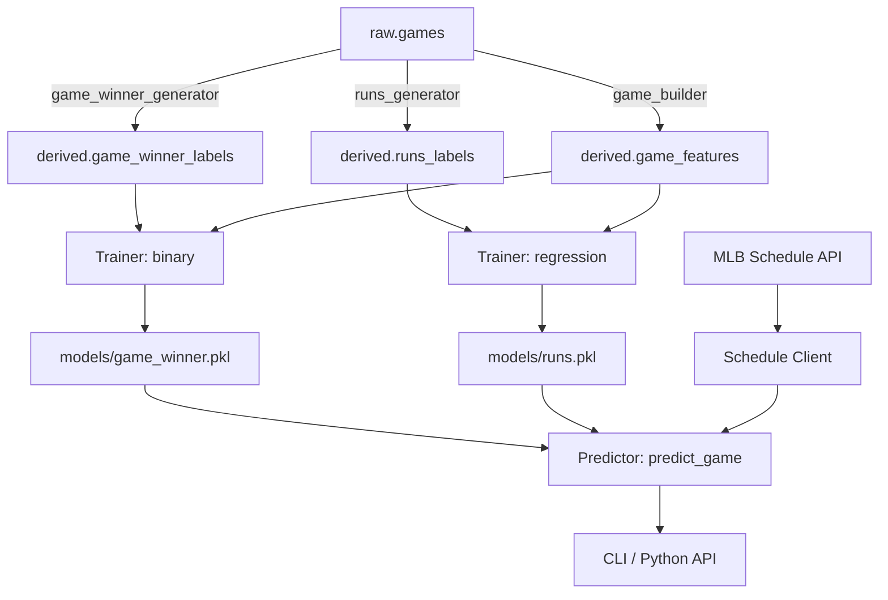

# Design Document — Sandy Phase 1.5: Additional Prediction Targets

## Overview

Phase 1.5 extends Sandy with two new prediction targets (game winner, total runs), a today's-schedule lookup, batch prediction, and automatic starter resolution — all reusing the existing 3-season backfill data in Postgres. No new ingestion is needed.

The design adds:
- **Game-level label generators** (`game_winner`, `runs`) following the same pure-function pattern as the existing `reached_base` generator
- **Game-level feature builder** with a new `GAME_FEATURE_NAMES` schema (10 features)
- **Multi-target training** dispatching to binary or regression LightGBM objectives
- **Multi-target prediction API** with a `target` parameter selecting model + feature path
- **Schedule client** fetching today's games + probable pitchers from the MLB Stats API
- **CLI extensions**: `--target` flag on `predict`, new `sandy today` and `sandy predict-all` commands
- **Model artifacts stored by target name**: `{model_dir}/{target}.pkl`

All new prediction logic is exposed as importable Python functions for Phase 2+ agents.

## Architecture

### Module Layout (additions in bold)

```
sandy/
├── cli/
│   ├── main.py              # extended: registers today_cmd, predict_all_cmd
│   ├── predict_cmd.py       # extended: --target flag, auto-resolve starter
│   ├── **today_cmd.py**     # NEW: sandy today
│   └── **predict_all_cmd.py** # NEW: sandy predict-all
├── config.py                # extended: ModelConfig → model_dir + target path resolution
├── features/
│   ├── builder.py           # existing inning-level builder (unchanged)
│   ├── **game_builder.py**  # NEW: game-level feature builder
│   ├── schema.py            # extended: GAME_FEATURE_NAMES, GAME_FEATURE_SCHEMA_VERSION
│   └── runner.py            # extended: game-level feature persistence
├── labels/
│   ├── generator.py         # existing reached_base generator (unchanged)
│   ├── **game_winner_generator.py** # NEW: game_winner label generator
│   ├── **runs_generator.py**        # NEW: runs label generator
│   └── runner.py            # extended: game_winner + runs label persistence
├── predict/
│   ├── predictor.py         # extended: predict_game(), multi-target dispatch
│   └── __init__.py          # extended: exports predict_game
├── **schedule/**
│   ├── **client.py**        # NEW: schedule lookup + probable pitcher resolution
│   └── **__init__.py**
├── schemas.py               # extended: new dataclasses
├── train/
│   ├── artifact.py          # extended: target_name in metadata, path-by-target
│   ├── trainer.py           # extended: game-level training, regression objective
│   └── split.py             # unchanged
└── db.py                    # unchanged
```

### Data Flow



### Key Design Decisions

1. **Separate game-level feature schema** rather than reusing inning-level features. Game predictions don't need inning-specific context (lineup spots due up, pitches thrown, within-game momentum). They need team-vs-team matchup context.

2. **Model artifacts keyed by target name** (`game_winner.pkl`, `runs.pkl`, `reached_base.pkl`). The existing `latest.pkl` path continues to work for `reached_base` via backward-compatible config resolution.

3. **Schedule client in its own module** (`sandy/schedule/`) rather than inside `ingest/`. The schedule lookup is a read-only, prediction-time operation — conceptually different from the backfill ingestion pipeline.

4. **Auto-resolve starter is prediction-layer logic**, not CLI-layer. This keeps it available to Phase 2+ agents calling `predict_game()` directly.

## Components and Interfaces

### 1. Game Winner Label Generator

**Module:** `sandy/labels/game_winner_generator.py`

```python
@dataclass(frozen=True)
class GameWinnerLabel:
    game_pk: int
    home_team_wins: bool

def generate_game_winner_label(conn: Connection, game_pk: int) -> GameWinnerLabel | None:
    """Pure function. Returns None if game is not Final, not regular season, or tied."""
```

**Behavior:**
- Reads `raw.games` for the given `game_pk`
- Returns `None` if `status != 'Final'` or `game_type != 'R'` or `home_score == away_score`
- Returns `GameWinnerLabel(game_pk, home_score > away_score)` otherwise

### 2. Runs Label Generator

**Module:** `sandy/labels/runs_generator.py`

```python
@dataclass(frozen=True)
class RunsLabel:
    game_pk: int
    team_code: str
    runs: int

def generate_runs_labels(conn: Connection, game_pk: int) -> list[RunsLabel]:
    """Pure function. Returns [] if game is not Final or not regular season.
    Otherwise returns exactly 2 labels (home + away)."""
```

### 3. Game-Level Feature Builder

**Module:** `sandy/features/game_builder.py`

```python
def build_game_feature_vector(
    conn: Connection,
    game_pk: int | None,
    team_code: str,
    opp_team_code: str,
    home_starter_id: int,
    away_starter_id: int,
    game_date: date,
    venue_id: int | None = None,
) -> GameFeatureVector:
    """Pure function. Builds game-level features for one (game, team) pair."""
```

**Features (GAME_FEATURE_NAMES):**

| # | Name | Description |
|---|------|-------------|
| 1 | `home_starter_era` | Home starter season ERA (before game_date) |
| 2 | `home_starter_whip` | Home starter season WHIP |
| 3 | `away_starter_era` | Away starter season ERA |
| 4 | `away_starter_whip` | Away starter season WHIP |
| 5 | `home_trailing15_rpg` | Home team runs/game over trailing 15 games |
| 6 | `away_trailing15_rpg` | Away team runs/game over trailing 15 games |
| 7 | `home_season_obp` | Home team season OBP |
| 8 | `away_season_obp` | Away team season OBP |
| 9 | `ballpark_id` | Venue ID |
| 10 | `is_home` | 1 if the prediction is for the home team, 0 for away |

**Fallback rule:** If a starter has fewer than 3 appearances before `game_date`, use league-average ERA/WHIP for that season.

### 4. Multi-Target Predictor

**Module:** `sandy/predict/predictor.py` (extended)

```python
def predict_game(
    team: str,
    opp: str,
    target: str = "game_winner",
    *,
    starter: str | None = None,
    opp_starter: str | None = None,
    as_of: date | None = None,
    config: Config | None = None,
) -> PredictionResult:
    """High-level game prediction. Importable by Phase 2+ agents.
    
    If starter/opp_starter are None and target is game_winner/runs,
    auto-resolves from today's schedule.
    """
```

**Dispatch logic:**
- `target="reached_base"` → existing `predict()` (requires inning + starter)
- `target="game_winner"` → loads `game_winner.pkl`, uses game-level features, returns P(home wins)
- `target="runs"` → loads `runs.pkl`, uses game-level features, returns expected runs

### 5. Schedule Client

**Module:** `sandy/schedule/client.py`

```python
@dataclass(frozen=True)
class ScheduledGame:
    game_pk: int
    home_team_code: str
    away_team_code: str
    home_probable_pitcher: str | None
    away_probable_pitcher: str | None
    game_time_utc: datetime
    status: str

def get_todays_schedule(config: Config | None = None) -> list[ScheduledGame]:
    """Fetch today's MLB schedule with probable pitchers.
    Reuses MlbStatsClient for rate limiting and retries."""

def resolve_starter_for_matchup(
    schedule: list[ScheduledGame],
    team: str,
    opp: str,
) -> tuple[str, str]:
    """Returns (home_starter, away_starter) for the given matchup.
    Raises InvalidInputError if matchup not found or pitcher TBD."""
```

**API endpoint:** `GET /v1/schedule?sportId=1&date={today}&hydrate=probablePitcher`

### 6. CLI Extensions

**`sandy predict` (extended):**
- New `--target` option: `reached_base` (default), `game_winner`, `runs`
- When target is `game_winner`/`runs`: `--inning` not required, `--starter` optional (auto-resolves)
- When target is `reached_base`: `--inning` and `--starter` required (Phase 1 behavior preserved)

**`sandy today` (new):**
- Fetches and displays today's schedule as a formatted table
- Columns: Time, Away, Home, Away Pitcher, Home Pitcher, Status
- TBD for unannounced pitchers

**`sandy predict-all` (new):**
- Fetches today's schedule
- For each game with both pitchers announced: runs game_winner + runs predictions
- Outputs summary table (or JSON with `--json`)
- Skips games with TBD pitchers

### 7. Model Artifact Storage

**Path resolution:**
```
{model_dir}/{target_name}.pkl

Examples:
  ./models/reached_base.pkl   (new canonical path)
  ./models/game_winner.pkl
  ./models/runs.pkl
  ./models/latest.pkl         (backward compat: symlink or fallback for reached_base)
```

**Config changes:**
- `ModelConfig.path` → `ModelConfig.model_dir` (directory, not file)
- New helper: `ModelConfig.artifact_path(target: str) -> Path`
- `MLB_MODEL_DIR` env var overrides the directory
- `MLB_MODEL_PATH` continues to work for `reached_base` (backward compat)

**Artifact metadata extension:**
```python
@dataclass(frozen=True)
class ModelArtifact:
    model: Any
    feature_names: list[str]
    feature_schema_version: int
    target_name: str              # NEW: "reached_base", "game_winner", "runs"
    training_window_start: date
    training_window_end: date
    created_at: datetime
```

## Data Models

### New DB Tables

#### `derived.game_winner_labels`

```sql
CREATE TABLE derived.game_winner_labels (
    game_pk        INTEGER PRIMARY KEY REFERENCES raw.games(game_pk),
    home_team_wins BOOLEAN NOT NULL,
    labeled_at     TIMESTAMPTZ NOT NULL DEFAULT now()
);
```

#### `derived.runs_labels`

```sql
CREATE TABLE derived.runs_labels (
    game_pk    INTEGER NOT NULL REFERENCES raw.games(game_pk),
    team_code  CHAR(3) NOT NULL,
    runs       INTEGER NOT NULL,
    labeled_at TIMESTAMPTZ NOT NULL DEFAULT now(),
    PRIMARY KEY (game_pk, team_code)
);
```

#### `derived.game_features`

```sql
CREATE TABLE derived.game_features (
    game_pk                INTEGER NOT NULL REFERENCES raw.games(game_pk),
    team_code              CHAR(3) NOT NULL,
    feature_schema_version INTEGER NOT NULL,
    home_starter_era       REAL,
    home_starter_whip      REAL,
    away_starter_era       REAL,
    away_starter_whip      REAL,
    home_trailing15_rpg    REAL,
    away_trailing15_rpg    REAL,
    home_season_obp        REAL,
    away_season_obp        REAL,
    ballpark_id            INTEGER,
    is_home                BOOLEAN NOT NULL,
    computed_at            TIMESTAMPTZ NOT NULL DEFAULT now(),
    PRIMARY KEY (game_pk, team_code)
);
```

### New Dataclasses (in `sandy/schemas.py`)

```python
@dataclass(frozen=True)
class GameWinnerLabel:
    game_pk: int
    home_team_wins: bool

@dataclass(frozen=True)
class RunsLabel:
    game_pk: int
    team_code: str
    runs: int

@dataclass(frozen=True)
class GameFeatureVector:
    game_pk: int | None
    team_code: str
    feature_schema_version: int
    values: dict[str, float | int | bool]

@dataclass(frozen=True)
class ScheduledGame:
    game_pk: int
    home_team_code: str
    away_team_code: str
    home_probable_pitcher: str | None
    away_probable_pitcher: str | None
    game_time_utc: datetime
    status: str
```

### Game Feature Schema Constants

```python
GAME_FEATURE_SCHEMA_VERSION: int = 1

GAME_FEATURE_NAMES: list[str] = [
    "home_starter_era",
    "home_starter_whip",
    "away_starter_era",
    "away_starter_whip",
    "home_trailing15_rpg",
    "away_trailing15_rpg",
    "home_season_obp",
    "away_season_obp",
    "ballpark_id",
    "is_home",
]
```

## Correctness Properties

*A property is a characteristic or behavior that should hold true across all valid executions of a system — essentially, a formal statement about what the system should do. Properties serve as the bridge between human-readable specifications and machine-verifiable correctness guarantees.*

### Property 1: Game winner label correctness

*For any* game row with known home_score, away_score, status, and game_type, the game_winner label generator SHALL produce `home_team_wins = True` when `home_score > away_score`, `home_team_wins = False` when `home_score < away_score`, and no label when status != 'Final', game_type != 'R', or scores are equal.

**Validates: Requirements 1.1, 1.2, 1.4, 1.5**

### Property 2: Runs label correctness

*For any* game row with known home_score, away_score, status='Final', and game_type='R', the runs label generator SHALL produce exactly two labels: one with `runs = home_score` for the home team and one with `runs = away_score` for the away team. For non-Final or non-regular-season games, it SHALL produce no labels.

**Validates: Requirements 2.1, 2.2, 2.4**

### Property 3: Game feature vector completeness

*For any* valid (game_pk, team_code) pair with a Final regular-season game, the game feature builder SHALL produce a feature vector containing all 10 fields defined in GAME_FEATURE_NAMES, with no None values (fallbacks applied where data is sparse).

**Validates: Requirements 3.1, 3.5**

### Property 4: No future leakage in game features

*For any* game with game_date D, all pitcher stats and team trailing stats in the game feature vector SHALL be computed using only data from games with game_date < D.

**Validates: Requirements 3.2, 3.3**

### Property 5: Game winner probability range

*For any* valid game feature vector, the game_winner predictor SHALL return a probability in the closed interval [0.0, 1.0].

**Validates: Requirements 6.2**

### Property 6: Runs prediction non-negativity

*For any* valid game feature vector, the runs predictor SHALL return a non-negative float (expected runs >= 0.0).

**Validates: Requirements 6.3**

### Property 7: Model path construction

*For any* target name in {"reached_base", "game_winner", "runs"} and any model_dir path, the resolved artifact path SHALL equal `model_dir / f"{target_name}.pkl"`.

**Validates: Requirements 4.5, 5.4, 13.1, 13.3**

### Property 8: Schedule response parsing completeness

*For any* valid MLB schedule API response (including responses with missing probable pitchers), the parser SHALL produce a list of ScheduledGame objects where each has non-None game_pk, home_team_code, away_team_code, game_time_utc, and status. Pitcher fields SHALL be None when not present in the response.

**Validates: Requirements 7.2, 7.3**

### Property 9: Case-insensitive team matching in auto-resolve

*For any* team code string and any case variation of that string, the auto-resolve logic SHALL find the same matchup in the schedule.

**Validates: Requirements 8.5**

### Property 10: Predict-all JSON serialization

*For any* list of prediction results, the `--json` output of `predict-all` SHALL be a valid JSON array where each element contains `home_team`, `away_team`, `win_probability`, `home_expected_runs`, and `away_expected_runs` fields.

**Validates: Requirements 11.4**

### Property 11: Idempotent label and feature writes

*For any* game's labels or features, writing them to the database twice SHALL produce the same table state as writing them once (UPSERT semantics).

**Validates: Requirements 12.4**

### Property 12: Model artifact round-trip

*For any* valid ModelArtifact (game_winner or runs), saving to disk then loading SHALL produce an artifact that generates numerically identical predictions on the same input feature vector.

**Validates: Requirements 14.1, 14.2**

## Error Handling

| Condition | Error Type | CLI Exit Code |
|-----------|-----------|---------------|
| Invalid team code | `InvalidInputError` | 2 |
| Invalid target name | `click.BadParameter` | 2 |
| Missing `--starter` for reached_base | `click.UsageError` | 2 |
| Missing `--inning` for reached_base | `click.UsageError` | 2 |
| Model artifact not found | `MissingArtifactError` | 3 |
| Feature schema mismatch | `FeatureSchemaMismatch` | 3 |
| Target name mismatch on load | `TargetMismatchError` | 3 |
| MLB API unreachable | `MlbApiRetryExhausted` | 1 |
| Matchup not in today's schedule | `InvalidInputError` | 2 |
| Probable pitcher TBD | `InvalidInputError` | 2 |
| Training quality below threshold | `TrainingQualityError` | 1 |
| Missing DB config | `MissingConfigError` | 4 |

**Error propagation strategy:**
- Label generators and feature builders raise no errors — they return empty/None for invalid inputs
- The predictor layer raises typed exceptions that the CLI translates to exit codes
- Schedule client wraps `MlbApiError`/`MlbApiRetryExhausted` with context about what was being fetched
- All errors are logged as structured JSON before the CLI exits

## Testing Strategy

### Property-Based Tests (using Hypothesis)

Each correctness property maps to one property-based test with minimum 100 iterations:

| Property | Test File | Strategy |
|----------|-----------|----------|
| 1: Game winner label correctness | `tests/test_pbt_game_winner_labels.py` | Generate random (home_score, away_score, status, game_type) tuples |
| 2: Runs label correctness | `tests/test_pbt_runs_labels.py` | Generate random game rows with scores |
| 3: Feature vector completeness | `tests/test_pbt_game_features.py` | Generate random game contexts with varying pitcher histories |
| 4: No future leakage | `tests/test_pbt_game_features.py` | Generate games with known date boundaries, verify no future data used |
| 5: Probability range | `tests/test_pbt_probability_range.py` (extended) | Generate random game feature vectors, predict, check [0,1] |
| 6: Runs non-negativity | `tests/test_pbt_runs_prediction.py` | Generate random game feature vectors, predict, check >= 0 |
| 7: Model path construction | `tests/test_pbt_model_path.py` | Generate random target names and dirs |
| 8: Schedule parsing | `tests/test_pbt_schedule_parser.py` | Generate random valid API response JSON structures |
| 9: Case-insensitive matching | `tests/test_pbt_schedule_parser.py` | Generate random case variations of team codes |
| 10: JSON serialization | `tests/test_pbt_predict_all_json.py` | Generate random prediction result lists |
| 11: Idempotent writes | `tests/test_pbt_idempotent_ingest.py` (extended) | Generate random label/feature data, write twice |
| 12: Artifact round-trip | `tests/test_pbt_serializer_roundtrip.py` (extended) | Generate random model artifacts with target metadata |

**Tag format:** `# Feature: sandy-phase1-5, Property {N}: {title}`

### Unit Tests (example-based)

- CLI `--target` option validation (valid choices, invalid choice error)
- CLI exit codes for each error condition
- `sandy today` with empty schedule → "No MLB games scheduled for today"
- `sandy predict-all` with all TBD pitchers → skip message
- Backward compatibility: `MLB_MODEL_PATH` still works for `reached_base`
- Starter fallback: pitcher with < 3 appearances uses league average
- Auto-resolve: matchup not found → clear error message

### Integration Tests

- End-to-end: `sandy labels build` populates `derived.game_winner_labels` and `derived.runs_labels`
- End-to-end: `sandy features build --target game_winner` populates `derived.game_features`
- End-to-end: `sandy train --target game_winner` produces `models/game_winner.pkl`
- End-to-end: `sandy predict --target game_winner --team SEA --opp LAD` returns valid JSON
- Schedule client against live MLB API (skipped in CI, manual verification)

### Test Configuration

- **PBT library:** Hypothesis (already in dev dependencies from Phase 1)
- **Minimum iterations:** 100 per property (`@settings(max_examples=100)`)
- **Test runner:** pytest with `--run` flag for single execution
- **Mocking:** `unittest.mock.patch` for DB connections in label/feature PBTs; mock `MlbStatsClient` for schedule tests
