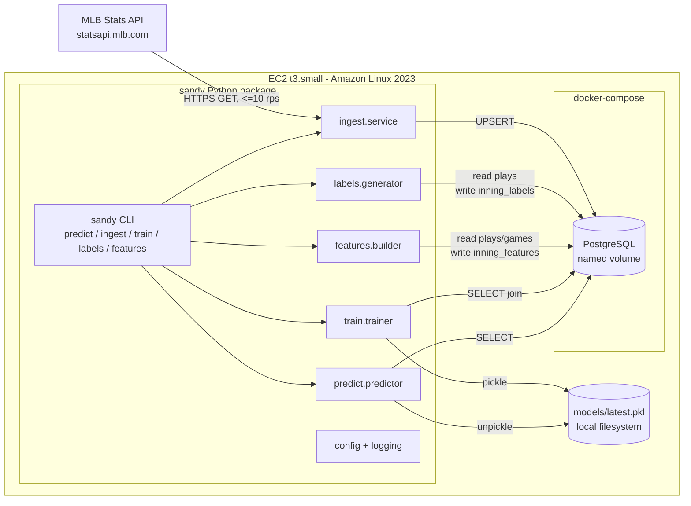
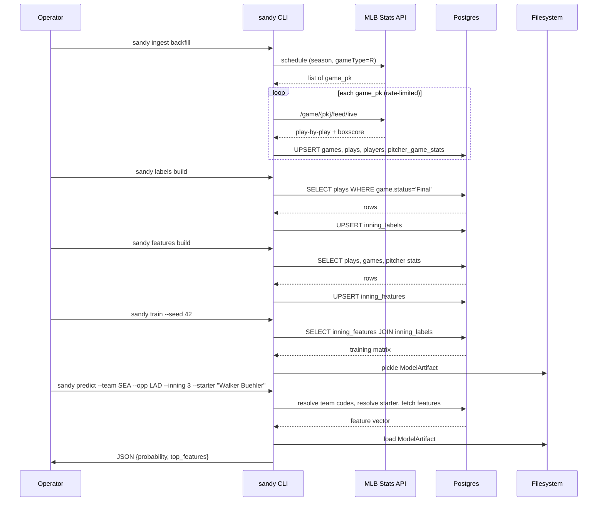
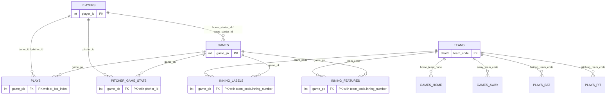

# Design Document — Sandy, Phase 1

## Overview

Sandy Phase 1 is an offline data + modeling foundation that produces per-inning "reaches base" probabilities for an MLB team, exposed through a local CLI on a single EC2 host. The system has four logical pipelines: **ingest** (MLB Stats API → Postgres `raw` schema), **label** (raw → `derived.inning_labels`), **feature** (raw → `derived.inning_features`), **train** (labels + features → pickled LightGBM artifact), and **predict** (CLI args + model + DB → JSON on stdout).

Phase 1 has a single human user, runs on a t3.small EC2 with Amazon Linux 2023, and is developed from a Mac against that EC2 over SSH. Postgres runs in docker-compose, everything else is native Python 3.11. No live-game features, no agents, no chat surface.

The design is deliberately biased toward:

- **Pure functions as the public API** so Phase 2+ agents can import them directly (`predict_from_features`, `build_feature_vector`, `generate_labels`).
- **Explicit schemas with forward room** so Phase 5 context tables (weather, social, odds) can be added additively.
- **Deterministic, idempotent pipelines** so any stage can be re-run safely and tests can assert byte-equivalence.
- **JSON-structured logs and env-var-driven config** so later orchestration layers have clean seams to grab.

Non-goals for Phase 1: live game state, Telegram, agents, proactive push, runs/strikeouts prediction, postseason, paid data feeds, multi-user auth, cloud services beyond the single EC2 and its Postgres container.

## Architecture

### Component Diagram



### Deployment Topology

- **Dev (Mac)**: editor + local `uv` environment. No Postgres locally; tests use a throwaway Postgres container launched per test session via `testcontainers-python`. Developer SSHes into EC2 to run real ingestion/training.
- **Runtime (EC2)**: single t3.small. Postgres 16 in docker-compose, named volume `sandy_pgdata` mounted at `/var/lib/postgresql/data`. The Python package is installed via `uv sync` from a clone on the host. Console script `sandy` is on PATH. Model artifact lives in `~/sandy/models/latest.pkl` (configurable).

### Data Flow



### Pipeline Dependencies

```
ingest (raw.*) --> labels (derived.inning_labels)
                \-> features (derived.inning_features)
                                          \
                                           --> train (models/*.pkl)
                                                          \
                                                           --> predict
```

`sandy train` will, for convenience, invoke `labels build` and `features build` for any game not yet labeled/featured before fitting. Each stage remains independently invokable.

## Components and Interfaces

### Module Layout

```
sandy/
├── __init__.py              # exports public API: predict_from_features, etc.
├── config.py                # Config dataclass, load_config()
├── logging.py               # configure_logging(), get_logger()
├── db.py                    # create_engine(), session context manager, DDL
├── schemas.py               # DB-agnostic TypedDict row types
├── ingest/
│   ├── __init__.py
│   ├── client.py            # MlbStatsClient: rate limit + retry + HTTP
│   ├── parsers.py           # raw JSON -> TypedDict rows (pure)
│   └── service.py           # backfill_seasons(), incremental_ingest()
├── labels/
│   ├── __init__.py
│   ├── generator.py         # generate_labels_for_game() pure
│   └── runner.py            # batch runner that persists
├── features/
│   ├── __init__.py
│   ├── schema.py            # FEATURE_NAMES, FEATURE_SCHEMA_VERSION
│   ├── builder.py           # build_feature_vector() pure
│   └── runner.py            # batch runner that persists
├── train/
│   ├── __init__.py
│   ├── trainer.py           # train_model() pure-ish
│   ├── artifact.py          # save_artifact(), load_artifact()
│   └── split.py             # chronological_split() pure
├── predict/
│   ├── __init__.py
│   └── predictor.py         # predict_from_features(), predict()
└── cli/
    ├── __init__.py
    ├── main.py              # click entry point, registers subcommands
    ├── predict_cmd.py
    ├── ingest_cmd.py
    ├── train_cmd.py
    ├── labels_cmd.py
    └── features_cmd.py
```

**Import direction rule**: `cli/*` imports from everything; `predict`, `train`, `features`, `labels`, `ingest` import from `config`, `logging`, `db`, `schemas` and nothing else at package scope. No cross-pipeline imports (e.g. `predict` does not import from `train` except for `train.artifact.load_artifact`).

### Public (Library) API

These signatures are the contract Phase 2+ agents will depend on. They are pure or near-pure (DB reads allowed, no network, no stdout writes):

```python
# sandy/features/builder.py
def build_feature_vector(
    conn: Connection,
    team_code: str,
    opp_team_code: str,
    inning_number: int,
    opp_starter_id: int,
    game_date: date,
    game_pk: int | None = None,
    as_of: datetime | None = None,
) -> FeatureVector:
    """Pure function: read DB, return a FeatureVector dataclass.
    If game_pk is None, builds a hypothetical-inning feature vector
    (used for predict). If set, builds the historical vector for that
    row (used for training feature generation).
    """

# sandy/labels/generator.py
def generate_labels_for_game(
    conn: Connection, game_pk: int
) -> list[InningLabel]:
    """Pure function over DB state: one row per (team_code, inning_number)."""

# sandy/predict/predictor.py
def predict_from_features(
    features: FeatureVector,
    artifact: ModelArtifact,
) -> PredictionResult:
    """Pure: no DB, no filesystem. Returns probability + top features.
    This is the STABLE entry point Phase 2+ agents will import."""

def predict(
    team: str, opp: str, inning: int, starter: str,
    *, as_of: date | None = None,
    config: Config | None = None,
) -> PredictionResult:
    """High-level convenience: resolves inputs via DB, builds features,
    loads latest artifact, returns result."""

# sandy/train/artifact.py
def save_artifact(artifact: ModelArtifact, path: Path) -> None: ...
def load_artifact(path: Path) -> ModelArtifact: ...

# sandy/train/trainer.py
def train_model(
    conn: Connection,
    *, seed: int = 42,
    training_window: tuple[date, date] | None = None,
) -> ModelArtifact: ...
```

Dataclasses used in signatures:

```python
@dataclass(frozen=True)
class FeatureVector:
    game_pk: int | None
    team_code: str
    inning_number: int
    feature_schema_version: int
    values: dict[str, float | int | bool]   # keyed by FEATURE_NAMES

@dataclass(frozen=True)
class ModelArtifact:
    model: lightgbm.Booster
    feature_names: list[str]
    feature_schema_version: int
    training_window_start: date
    training_window_end: date
    created_at: datetime

@dataclass(frozen=True)
class TopFeature:
    name: str
    contribution: float

@dataclass(frozen=True)
class PredictionResult:
    probability: float
    top_features: list[TopFeature]

    def to_json(self) -> str: ...   # matches CLI JSON output
```

### MLB Stats API Usage

Base URL: `https://statsapi.mlb.com/api`. No auth. Public, documented but unofficial.

**Endpoints used:**

| Endpoint | Purpose |
|---|---|
| `GET /v1/schedule?sportId=1&startDate=YYYY-MM-DD&endDate=YYYY-MM-DD&gameType=R` | Enumerate regular-season `game_pk` values in a window |
| `GET /v1.1/game/{game_pk}/feed/live` | Full play-by-play, lineups, boxscore, venue, statuses |
| `GET /v1/teams?sportId=1&season=YYYY` | Canonical team list for a season (populates `raw.teams`) |
| `GET /v1/people/{player_id}?hydrate=stats(group=[pitching],type=[season],season=YYYY)` | Season-to-date pitcher stats (fallback when we cannot derive from plays) |

**Pagination / date-range strategy.** `/v1/schedule` accepts a `startDate`/`endDate` window. To avoid massive single responses we iterate in one-month windows per season. The `schedule` response has `dates[].games[]`; we flatten to a list of `{game_pk, game_date, status}`.

**Expected volumes.** ~2,430 regular-season games per season × 3 seasons = ~7,290 games. Each game feed is ~500 KB–2 MB JSON. Total raw ingest ~8 GB bandwidth, ~40k–60k DB-inserted plays per season. At 10 rps, full backfill completes in ~15–25 minutes of API time; total wall-clock including DB writes ~30–45 minutes on t3.small.

**Rate limiting.** `MlbStatsClient` uses a token-bucket limiter keyed to `config.ingest.max_rps` (default 10). Implementation: a single-threaded client with `time.monotonic()` spacing is enough given the scale; no need for `aiohttp`. This satisfies requirement 1.7.

**Retry policy.** On HTTP 429 or 5xx, exponential backoff with base delay from config (default 1.0s), factor 2, jitter ±25%, up to 5 attempts (requirement 1.3). On the 5th failure, the failing `game_pk` and error reason are inserted into `raw.ingest_failures` and processing continues (requirement 1.4).

**Error classification:**

- `429` or `5xx` → retryable
- `4xx` other than 429 → non-retryable; recorded to `ingest_failures` immediately
- `json.JSONDecodeError` or schema validation mismatch → non-retryable; recorded to `ingest_failures`
- Network timeouts / connection errors → retryable

### Ingestion Service

`sandy/ingest/service.py` exposes two entry points:

```python
def backfill_seasons(conn: Connection, client: MlbStatsClient, seasons: list[int]) -> BackfillStats: ...
def incremental_ingest(conn: Connection, client: MlbStatsClient) -> IncrementalStats: ...
```

**Backfill algorithm** (requirement 1):

1. For each season, list all regular-season `game_pk` via `/v1/schedule` in one-month windows.
2. For each `game_pk` not already in `raw.games` with `status='Final'` (resumes from interruption, requirement 1.6), fetch `/v1.1/game/{pk}/feed/live`.
3. Parse to TypedDict rows (`games`, `plays`, `players`, `pitcher_game_stats`). Parsers are pure.
4. In a single transaction per `game_pk`: `DELETE FROM plays WHERE game_pk=?; UPSERT INTO games; INSERT plays; UPSERT players; UPSERT pitcher_game_stats;`. Transaction-per-game gives atomicity (requirement 1.6 resume + 2.3 final-status overwrite).
5. Every 50 games, emit a progress log line with `games_processed`, `games_remaining`, `elapsed_seconds` (requirement 1.5).
6. Idempotent because (a) UPSERT on `games.game_pk`, (b) DELETE-then-INSERT on `plays` keyed by `game_pk` inside the transaction, (c) UPSERT on `players.player_id`, (d) UPSERT on `pitcher_game_stats (game_pk, pitcher_id)` (requirement 1.2).

**Incremental algorithm** (requirement 2):

1. `max_final_date = SELECT MAX(game_date) FROM raw.games WHERE status='Final'`
2. Fetch schedule from `max_final_date` (inclusive, to catch late-finalizing games) through today.
3. For each game returned:
   - If already in DB with `status='Final'` → skip.
   - If present with non-final status and API now says `Final` → same transaction as backfill (requirement 2.3).
   - If new → same transaction as backfill.
4. Emit summary line `{games_added, games_updated, games_skipped}` (requirement 2.5).

### Label Generator

`sandy/labels/generator.py`:

```python
REACHES_BASE_EVENT_CODES: frozenset[str] = frozenset({
    "single", "double", "triple", "home_run",
    "walk", "hit_by_pitch", "field_error",
})

def generate_labels_for_game(conn: Connection, game_pk: int) -> list[InningLabel]:
    """Return one InningLabel per (team_code, inning_number) present in plays."""
```

The function:

1. `SELECT inning, half_inning, batting_team_code, event_code FROM raw.plays WHERE game_pk = ?`
2. Skip if `raw.games.status != 'Final'` (requirement 4.6).
3. Group by `(batting_team_code, inning)`.
4. Emit one `InningLabel` per group with `reached_base = any(ec in REACHES_BASE_EVENT_CODES for ec in group)`.
5. If the team batted in an inning but produced zero reach-base events, explicit `reached_base=False`. Groups that don't exist (e.g. bottom of 9th not played in a home-team win) are simply not emitted, so `inning_labels` is a partial table — no false zeros.

`sandy/labels/runner.py` iterates all Final games, calls the pure generator, and UPSERTs into `derived.inning_labels`. Idempotent via PK `(game_pk, team_code, inning_number)` (requirement 4.4). Monotonicity (requirement 4.5) follows because `reached_base` is the OR of event-code matches — adding events can only flip false→true.

### Feature Builder

Two schema-level concepts:

```python
# sandy/features/schema.py
FEATURE_SCHEMA_VERSION = 1
FEATURE_NAMES: list[str] = [
    "opp_starter_era",
    "opp_starter_whip",
    "opp_starter_k9",
    "opp_starter_pitches_before",
    "lineup_spot_1",
    "lineup_spot_2",
    "lineup_spot_3",
    "is_home",
    "ballpark_id",
    "inning_number_feat",
    "trailing15_rpg",
    "trailing15_obp",
]
```

Bumping `FEATURE_SCHEMA_VERSION` means the feature set has changed in a way that invalidates existing `inning_features` rows and model artifacts (enforced by requirement 7.3 at load time).

**Leakage prevention.** Requirement 5.1 is the design's hardest constraint. The builder computes a `cutoff_ts` = `min(start_time_utc) over plays for (game_pk, target inning, top of inning for away team / bottom for home team)`. Every aggregate is bounded to rows with `start_time_utc < cutoff_ts` (for same-game stats) or `game_date < this.game_date` (for cross-game rollups). For prediction-time calls where `game_pk is None`, `cutoff_ts = None` and same-game features are computed against an empty set (or, if `--as-of` is supplied, bounded by that date).

**Per-feature logic** (SQL-flavored pseudo; real impl uses SQLAlchemy Core parameterized queries):

| Feature | Computation |
|---|---|
| `opp_starter_era` | `9 * sum(runs_allowed) / (sum(outs_recorded)/3.0)` over `raw.pitcher_game_stats WHERE pitcher_id = :starter AND game_pk IN (SELECT game_pk FROM raw.games WHERE season = :season AND game_date < :game_date AND status='Final')`. If denominator = 0, omit row (requirement 5.4). |
| `opp_starter_whip` | `(sum(walks) + sum(hits_allowed)) / (sum(outs_recorded)/3.0)` over same window. |
| `opp_starter_k9` | `9 * sum(strikeouts) / (sum(outs_recorded)/3.0)` over same window. |
| `opp_starter_pitches_before` | `SELECT count(*) FROM raw.plays WHERE game_pk=:game_pk AND pitcher_id=:starter AND inning < :inning_number` — pitch-level data is not always in the feed, so we use plate-appearances-as-proxy unless the feed includes pitch events (see Data Models note). |
| `lineup_spot_1/2/3` | Derived from the last plate appearance by the batting team before `cutoff_ts`. Track the batting-order index of the PA that made the last out of the previous half-inning (or 0 if first inning), then the three due up are spots `[(last_idx % 9) + 1, ((last_idx+1) % 9) + 1, ((last_idx+2) % 9) + 1]`. For first inning (`inning_number=1`), it is deterministically `(1, 2, 3)`. For prediction with no play history, we fall back to `(1, 2, 3)` and log a warning. |
| `is_home` | `team_code == games.home_team_code` |
| `ballpark_id` | `games.venue_id` |
| `inning_number_feat` | `inning_number` (explicit copy to decouple feature from PK semantics) |
| `trailing15_rpg` | Avg runs scored by `team_code` across the 15 most recent Final games in `raw.games` with `game_date < :game_date`. Computed by summing run-scoring events per game from `raw.plays`. |
| `trailing15_obp` | Over the same 15-game window: `(H + BB + HBP) / (AB + BB + HBP + SF)`, computed from `raw.plays` event codes. |

Idempotence and determinism (requirement 5.3) follow from (a) read-only queries, (b) fixed sort orders with tie-breaks on `(game_date, game_pk, at_bat_index)`, (c) no randomness.

### Trainer

`sandy/train/trainer.py`:

```python
def train_model(
    conn: Connection,
    *, seed: int = 42,
    training_window: tuple[date, date] | None = None,
) -> ModelArtifact:
    df = _load_training_frame(conn, training_window)   # inner join labels + features
    train_df, val_df = chronological_split(df, val_fraction=0.15)
    booster = _fit_lightgbm(train_df, val_df, seed)
    metrics = _compute_val_metrics(booster, val_df)
    _log_metrics(metrics)
    if metrics.roc_auc < 0.52:
        raise TrainingQualityError(metrics.roc_auc)   # CLI translates to exit 1
    return ModelArtifact(
        model=booster,
        feature_names=FEATURE_NAMES,
        feature_schema_version=FEATURE_SCHEMA_VERSION,
        training_window_start=df["game_date"].min(),
        training_window_end=df["game_date"].max(),
        created_at=datetime.now(timezone.utc),
    )
```

**Chronological split** (requirement 6.2): sort unique `(game_date, game_pk)` tuples ascending; the last 15% of games by `game_date` define validation. All rows from those games go to validation, everything earlier to training. Splitting by game (not by row) prevents same-game leakage.

**LightGBM defaults** (requirement 6.1):

```python
params = {
    "objective": "binary",
    "metric": ["binary_logloss", "auc"],
    "learning_rate": 0.05,
    "num_leaves": 31,
    "min_data_in_leaf": 50,
    "feature_fraction": 0.9,
    "bagging_fraction": 0.8,
    "bagging_freq": 5,
    "verbose": -1,
    "seed": seed,
    "deterministic": True,
    "force_col_wise": True,
}
num_boost_round = 500
early_stopping_rounds = 50
```

`deterministic=True` + `force_col_wise=True` + fixed `seed` gives bit-stable training for the round-trip property (requirement 7.2 / 11.4).

**Metrics** (requirement 6.3): ROC AUC (sklearn), log loss, Brier score, positive/negative counts on validation. All logged as a single JSON line at `INFO`.

**Seed** (requirement 6.6): single `--seed` threads through `params["seed"]`, any `np.random.default_rng(seed)`, and pandas shuffling (we avoid shuffling; chronological split is deterministic).

### Model Artifact

Serialization format (requirement 7.1):

```python
# artifact.py
def save_artifact(artifact: ModelArtifact, path: Path) -> None:
    payload = {
        "model": artifact.model.model_to_string(),   # LightGBM text dump; stable across pickle versions
        "feature_names": artifact.feature_names,
        "feature_schema_version": artifact.feature_schema_version,
        "training_window_start": artifact.training_window_start.isoformat(),
        "training_window_end": artifact.training_window_end.isoformat(),
        "created_at": artifact.created_at.isoformat(),
    }
    path.parent.mkdir(parents=True, exist_ok=True)
    tmp = path.with_suffix(path.suffix + ".tmp")
    with tmp.open("wb") as f:
        pickle.dump(payload, f, protocol=pickle.HIGHEST_PROTOCOL)
    tmp.replace(path)   # atomic write
```

Using LightGBM's `model_to_string()` (rather than pickling the `Booster` directly) is what makes the round-trip property testable: the text form is deterministic and `lgb.Booster(model_str=...)` reconstructs a numerically identical model.

Loading:

```python
def load_artifact(path: Path) -> ModelArtifact:
    with path.open("rb") as f:
        payload = pickle.load(f)
    if payload["feature_schema_version"] != FEATURE_SCHEMA_VERSION:
        raise FeatureSchemaMismatch(
            loaded=payload["feature_schema_version"],
            current=FEATURE_SCHEMA_VERSION,
        )
    return ModelArtifact(
        model=lgb.Booster(model_str=payload["model"]),
        ...
    )
```

`FeatureSchemaMismatch` is caught by the CLI layer and translated to a non-zero exit with a message naming both versions (requirement 7.3).

### Predictor

`predict_from_features` is pure — no DB, no filesystem:

```python
def predict_from_features(
    features: FeatureVector, artifact: ModelArtifact,
) -> PredictionResult:
    if features.feature_schema_version != artifact.feature_schema_version:
        raise FeatureSchemaMismatch(...)
    x = np.array([[features.values[n] for n in artifact.feature_names]])
    proba = float(artifact.model.predict(x)[0])
    contribs = artifact.model.predict(x, pred_contrib=True)[0]   # len = n_feats + 1 (bias)
    named = list(zip(artifact.feature_names, contribs[:-1]))
    named.sort(key=lambda p: abs(p[1]), reverse=True)
    top = [TopFeature(name=n, contribution=float(c)) for n, c in named[:5]]
    return PredictionResult(probability=proba, top_features=top)
```

`predict()` is the high-level wrapper invoked by the CLI:

1. Validate `inning in 1..9` → exit 2 (requirement 8.5)
2. Resolve `team` and `opp` against `raw.teams.team_code` (case-insensitive) → exit 2 with "unrecognized code" (requirement 8.4)
3. Resolve starter via `SELECT player_id, full_name FROM raw.players WHERE LOWER(full_name) = LOWER(:name)`; if zero or multiple matches, run a Jaro-Winkler fuzzy search over all names and return top 5 matches → exit 2 (requirement 8.6)
4. Determine `as_of` date: `--as-of` if given, else `date.today()` (requirement 8.7)
5. Determine the hypothetical `game_date`: for prediction we use `as_of` as the effective "game date" for trailing-window queries. There is no `game_pk`, so same-game features (`opp_starter_pitches_before`, `lineup_spot_*`) use empty history: pitches_before=0, lineup spots=(1,2,3).
6. `features = build_feature_vector(conn, team, opp, inning, opp_starter_id, as_of, game_pk=None, as_of=as_of)`
7. `artifact = load_artifact(config.model.path)` — if file missing, exit 3 (requirement 8.8)
8. `result = predict_from_features(features, artifact)`
9. CLI prints `result.to_json()` to stdout

### CLI

Framework: `click` (small, typed, composable).

```
sandy [GLOBAL OPTIONS] COMMAND [COMMAND OPTIONS] [ARGS]

GLOBAL OPTIONS
  --config PATH       TOML config file (requirement 9.4)
  --log-level LEVEL   DEBUG|INFO|WARN|ERROR (requirement 10.3)
  --version

COMMANDS
  predict   Emit per-inning reach-base probability as JSON
  ingest    Fetch data from MLB Stats API
  train     Fit LightGBM model and write artifact
  labels    Manage derived.inning_labels
  features  Manage derived.inning_features
```

Per-subcommand signatures:

```
sandy predict --team CODE --opp CODE --inning N --starter NAME [--as-of YYYY-MM-DD]
sandy ingest backfill [--seasons N] [--start-season YYYY]
sandy ingest incremental
sandy train [--seed INT] [--output PATH]
sandy labels build [--game-pk INT]
sandy features build [--game-pk INT]
```

**Exit codes** (requirements 8.4, 8.5, 8.6, 8.8, 9.2):

| Code | Meaning |
|---|---|
| 0 | Success |
| 1 | Generic runtime error (training quality failure, unexpected exception) |
| 2 | Invalid user input (team code, inning, starter name) |
| 3 | Missing model artifact |
| 4 | Missing required environment variable |

### Configuration

`sandy/config.py` defines a `Config` dataclass with nested sections matching the TOML schema:

```python
@dataclass(frozen=True)
class DatabaseConfig:
    host: str; port: int; name: str; user: str; password: str

@dataclass(frozen=True)
class ModelConfig:
    path: Path

@dataclass(frozen=True)
class IngestConfig:
    max_rps: float = 10.0
    max_retries: int = 5
    retry_base_delay_seconds: float = 1.0

@dataclass(frozen=True)
class TrainingConfig:
    seed: int = 42
    num_boost_round: int = 500
    early_stopping_rounds: int = 50

@dataclass(frozen=True)
class LoggingConfig:
    level: str = "INFO"

@dataclass(frozen=True)
class Config:
    database: DatabaseConfig
    model: ModelConfig
    ingest: IngestConfig
    training: TrainingConfig
    logging: LoggingConfig
```

**Precedence** (requirement 9.4): defaults < TOML (`--config` or `./sandy.toml` if present) < env vars < explicit CLI flags. `load_config()` merges in that order. Missing required DB env vars → exit 4 with the variable name (requirement 9.2).

**TOML schema** (`sandy.example.toml`):

```toml
[database]
host = "localhost"
port = 5432
name = "sandy"
user = "sandy"
# password deliberately not in TOML; set MLB_DB_PASSWORD

[model]
path = "./models/latest.pkl"

[ingest]
max_rps = 10.0
max_retries = 5
retry_base_delay_seconds = 1.0

[training]
seed = 42

[logging]
level = "INFO"
```

**Env var mapping** (requirements 9.1, 9.3):

| Env var | Config field |
|---|---|
| `MLB_DB_HOST` | `database.host` |
| `MLB_DB_PORT` | `database.port` |
| `MLB_DB_NAME` | `database.name` |
| `MLB_DB_USER` | `database.user` |
| `MLB_DB_PASSWORD` | `database.password` |
| `MLB_MODEL_PATH` | `model.path` |
| `MLB_LOG_LEVEL` | `logging.level` |

### Logging

`sandy/logging.py` wraps the stdlib `logging` module with a JSON formatter. Each log line is one JSON object on its own line:

```json
{"timestamp":"2025-01-15T20:11:44.223Z","level":"INFO","component":"ingest.service","message":"backfill complete","games_added":7289,"games_skipped":1,"elapsed_seconds":1832.4}
```

Every component passes `component=<pipeline_name>` to the logger (requirement 10.1). Each long-running pipeline's final log line includes `duration_seconds`, `rows_read`, `rows_written` (requirement 10.2). The root logger level is set from `MLB_LOG_LEVEL` or `--log-level` (requirement 10.3).

### Packaging and Deployment

**pyproject.toml** (managed by `uv`, requirement 12.1):

```toml
[project]
name = "sandy"
version = "0.1.0"
description = "MLB per-inning reach-base predictor"
requires-python = "==3.11.*"              # requirement 12.2

dependencies = [
    "click>=8.1",
    "lightgbm>=4.3",
    "numpy>=1.26",
    "pandas>=2.2",
    "psycopg[binary]>=3.1",
    "scikit-learn>=1.4",
    "sqlalchemy>=2.0",
    "tomli>=2.0",
]

[project.optional-dependencies]
dev = [
    "hypothesis>=6.100",
    "pytest>=8.0",
    "pytest-cov>=5.0",
    "testcontainers[postgres]>=4.0",
    "ruff>=0.4",
    "mypy>=1.10",
]

[project.scripts]
sandy = "sandy.cli.main:cli"              # requirement 12.4

[tool.uv]
# uv-specific settings

[tool.ruff]
line-length = 100
target-version = "py311"
```

**docker-compose.yml** (requirements 3.5, 12.3):

```yaml
services:
  postgres:
    image: postgres:16
    environment:
      POSTGRES_DB: ${MLB_DB_NAME:-sandy}
      POSTGRES_USER: ${MLB_DB_USER:-sandy}
      POSTGRES_PASSWORD: ${MLB_DB_PASSWORD}
    ports:
      - "5432:5432"
    volumes:
      - sandy_pgdata:/var/lib/postgresql/data
    healthcheck:
      test: ["CMD-SHELL", "pg_isready -U $$POSTGRES_USER -d $$POSTGRES_DB"]
      interval: 5s
      timeout: 3s
      retries: 10

volumes:
  sandy_pgdata:
```

**Bootstrap on a fresh EC2** (requirement 12.4):

```
git clone <repo>; cd sandy
uv sync
export MLB_DB_PASSWORD=...
docker compose up -d
sandy ingest backfill    # or labels / features / train / predict
```

## Data Models

### Schema Layout

Two Postgres schemas: `raw` (canonical MLB Stats API truth) and `derived` (computed). A future `context` schema will hold weather/social/odds tables; none are created in Phase 1.

### Raw Schema

```sql
CREATE SCHEMA IF NOT EXISTS raw;

CREATE TABLE raw.teams (
    team_code        CHAR(3)     PRIMARY KEY,
    team_id          INTEGER     NOT NULL UNIQUE,
    name             TEXT        NOT NULL,
    venue_id         INTEGER,
    league           TEXT,
    division         TEXT,
    ingested_at      TIMESTAMPTZ NOT NULL DEFAULT now()
);

CREATE TABLE raw.players (
    player_id        INTEGER     PRIMARY KEY,
    full_name        TEXT        NOT NULL,
    primary_position TEXT,
    throws           CHAR(1),
    bats             CHAR(1),
    ingested_at      TIMESTAMPTZ NOT NULL DEFAULT now()
);
CREATE INDEX players_lower_name_idx ON raw.players (LOWER(full_name));

CREATE TABLE raw.games (
    game_pk          INTEGER     PRIMARY KEY,
    game_date        DATE        NOT NULL,
    season           INTEGER     NOT NULL,
    game_type        CHAR(1)     NOT NULL,            -- 'R' regular, 'P' post
    status           TEXT        NOT NULL,            -- 'Final', 'In Progress', ...
    home_team_code   CHAR(3)     NOT NULL REFERENCES raw.teams(team_code),
    away_team_code   CHAR(3)     NOT NULL REFERENCES raw.teams(team_code),
    venue_id         INTEGER,
    first_pitch_utc  TIMESTAMPTZ,
    home_score       INTEGER,
    away_score       INTEGER,
    home_starter_id  INTEGER     REFERENCES raw.players(player_id),
    away_starter_id  INTEGER     REFERENCES raw.players(player_id),
    raw_payload_hash TEXT        NOT NULL,            -- sha256 of full feed/live JSON
    ingested_at      TIMESTAMPTZ NOT NULL DEFAULT now()
);
CREATE INDEX games_date_idx   ON raw.games (game_date);
CREATE INDEX games_season_idx ON raw.games (season);
CREATE INDEX games_status_idx ON raw.games (status);

CREATE TABLE raw.plays (
    game_pk          INTEGER     NOT NULL REFERENCES raw.games(game_pk) ON DELETE CASCADE,
    at_bat_index     INTEGER     NOT NULL,             -- from feed/live allPlays[].atBatIndex
    inning           SMALLINT    NOT NULL,
    half_inning      CHAR(6)     NOT NULL CHECK (half_inning IN ('top','bottom')),
    batting_team_code CHAR(3)    NOT NULL REFERENCES raw.teams(team_code),
    pitching_team_code CHAR(3)   NOT NULL REFERENCES raw.teams(team_code),
    batter_id        INTEGER     REFERENCES raw.players(player_id),
    pitcher_id       INTEGER     REFERENCES raw.players(player_id),
    batting_order    SMALLINT,                         -- 1..9 for batter; nullable for pinch etc.
    event_type       TEXT        NOT NULL,             -- grouped: 'hit','walk','strikeout',...
    event_code       TEXT        NOT NULL,             -- raw: 'single','double','field_error',...
    is_reaches_base  BOOLEAN     NOT NULL,             -- denormalized for label gen speed
    pitches_in_pa    SMALLINT    NOT NULL DEFAULT 0,
    start_time_utc   TIMESTAMPTZ,
    end_time_utc     TIMESTAMPTZ,
    raw              JSONB       NOT NULL,             -- source atBat object for future re-extraction
    PRIMARY KEY (game_pk, at_bat_index)
);
CREATE INDEX plays_inning_idx          ON raw.plays (game_pk, inning, half_inning, at_bat_index);
CREATE INDEX plays_pitcher_idx         ON raw.plays (pitcher_id, game_pk);
CREATE INDEX plays_batting_team_idx    ON raw.plays (batting_team_code, game_pk);

CREATE TABLE raw.pitcher_game_stats (
    game_pk          INTEGER     NOT NULL REFERENCES raw.games(game_pk) ON DELETE CASCADE,
    pitcher_id       INTEGER     NOT NULL REFERENCES raw.players(player_id),
    team_code        CHAR(3)     NOT NULL REFERENCES raw.teams(team_code),
    pitches_thrown   INTEGER     NOT NULL DEFAULT 0,
    outs_recorded    INTEGER     NOT NULL DEFAULT 0,
    runs_allowed     INTEGER     NOT NULL DEFAULT 0,
    walks            INTEGER     NOT NULL DEFAULT 0,
    hits_allowed     INTEGER     NOT NULL DEFAULT 0,
    strikeouts       INTEGER     NOT NULL DEFAULT 0,
    is_starter       BOOLEAN     NOT NULL,
    PRIMARY KEY (game_pk, pitcher_id)
);
CREATE INDEX pgs_pitcher_idx ON raw.pitcher_game_stats (pitcher_id);

CREATE TABLE raw.ingest_failures (
    id               BIGSERIAL   PRIMARY KEY,
    game_pk          INTEGER,
    endpoint         TEXT,
    error_reason     TEXT        NOT NULL,
    http_status      INTEGER,
    retries          SMALLINT    NOT NULL DEFAULT 0,
    attempted_at     TIMESTAMPTZ NOT NULL DEFAULT now()
);
CREATE INDEX ingest_failures_game_idx ON raw.ingest_failures (game_pk);
```

Notes:

- `raw_payload_hash` lets us detect upstream changes without re-parsing. If a refetch produces the same hash, we skip the write (micro-optimization, not required).
- `raw JSONB` on `plays` is kept so Phase 2+ can re-extract pitch-level data without a re-ingest.
- `is_reaches_base` is denormalized onto `plays` to keep the Label_Generator's read cheap and to make the monotonicity property obvious: it becomes `BOOL_OR(is_reaches_base)`.

### Derived Schema

```sql
CREATE SCHEMA IF NOT EXISTS derived;

CREATE TABLE derived.inning_labels (
    game_pk          INTEGER     NOT NULL REFERENCES raw.games(game_pk) ON DELETE CASCADE,
    team_code        CHAR(3)     NOT NULL REFERENCES raw.teams(team_code),
    inning_number    SMALLINT    NOT NULL CHECK (inning_number BETWEEN 1 AND 20),
    reached_base     BOOLEAN     NOT NULL,
    labeled_at       TIMESTAMPTZ NOT NULL DEFAULT now(),
    PRIMARY KEY (game_pk, team_code, inning_number)
);

CREATE TABLE derived.inning_features (
    game_pk                    INTEGER     NOT NULL REFERENCES raw.games(game_pk) ON DELETE CASCADE,
    team_code                  CHAR(3)     NOT NULL REFERENCES raw.teams(team_code),
    inning_number              SMALLINT    NOT NULL CHECK (inning_number BETWEEN 1 AND 20),
    feature_schema_version     INTEGER     NOT NULL,

    opp_starter_era            REAL,
    opp_starter_whip           REAL,
    opp_starter_k9             REAL,
    opp_starter_pitches_before INTEGER,
    lineup_spot_1              SMALLINT    CHECK (lineup_spot_1 BETWEEN 1 AND 9),
    lineup_spot_2              SMALLINT    CHECK (lineup_spot_2 BETWEEN 1 AND 9),
    lineup_spot_3              SMALLINT    CHECK (lineup_spot_3 BETWEEN 1 AND 9),
    is_home                    BOOLEAN,
    ballpark_id                INTEGER,
    inning_number_feat         SMALLINT,
    trailing15_rpg             REAL,
    trailing15_obp             REAL,

    built_at                   TIMESTAMPTZ NOT NULL DEFAULT now(),
    PRIMARY KEY (game_pk, team_code, inning_number)
);
CREATE INDEX inning_features_version_idx ON derived.inning_features (feature_schema_version);
```

UPSERT semantics on both derived tables (requirement 3.4):

```sql
INSERT INTO derived.inning_labels (game_pk, team_code, inning_number, reached_base)
VALUES (:pk, :tc, :inn, :rb)
ON CONFLICT (game_pk, team_code, inning_number)
DO UPDATE SET reached_base = EXCLUDED.reached_base,
              labeled_at   = now();
```

### Entity-Relationship Diagram



### Forward Compatibility

Phase 5 tables are additive and will live in a new `context` schema so foreign keys and joins remain local to that schema:

- `context.weather (game_pk FK, fetched_at, wind_dir, wind_mph, temp_f, ...)`
- `context.umpire_game (game_pk FK, plate_umpire_id, k_rate_trailing30, ...)`
- `context.odds (game_pk FK, sportsbook, market, opened_at, closed_at, open_line, close_line)`
- `context.social_summary (game_pk FK, source, summary_text, sentiment, fetched_at)`

None of these require altering existing `raw` or `derived` tables. `inning_features` can gain columns via `ALTER TABLE ADD COLUMN` and a bumped `FEATURE_SCHEMA_VERSION`; existing artifacts continue to load/fail-clean against the schema-version check (requirement 7.3).

Assessment: PBT applies to this feature. Four property-based tests are explicitly required (requirement 11.1–11.4). Stopping here to run the prework tool before writing the Correctness Properties section.
