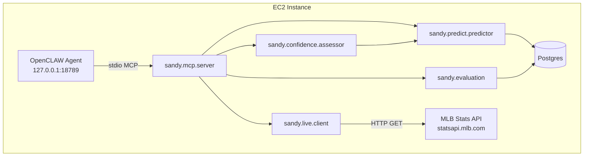

# Design Document — Sandy Phase 2

## Overview

Sandy Phase 2 transforms the offline prediction system into a live, conversational assistant. It adds four new module groups to the `sandy` package:

1. **`sandy/live/`** — On-demand live game state fetching from the MLB Stats API
2. **`sandy/mcp/`** — MCP server exposing Sandy tools over stdio for OpenCLAW
3. **`sandy/confidence/`** — Confidence signal generation (HIGH/LOW based on base-rate deviation)
4. **`sandy/evaluation/`** — Prediction logging, outcome reconciliation, and calibration reporting

Additionally, the existing `sandy/features/builder.py` and `sandy/features/schema.py` are extended with shutdown detection features to improve the reached_base model's ability to detect low-probability innings.

The system runs entirely on the existing t3.small EC2 instance. The MCP server communicates with OpenCLAW over stdio (local process, no network hops). Live game state is fetched on-demand (one HTTP request per question, no background poller). Predictions are logged to the existing Postgres instance for self-evaluation.

## Architecture



### Module Layout

```
sandy/
├── live/
│   ├── __init__.py
│   ├── client.py          # get_live_game_state() → LiveGameState
│   └── schemas.py         # LiveGameState, ShutdownFeatures dataclasses
├── mcp/
│   ├── __init__.py
│   ├── server.py          # MCP server main loop (stdio transport)
│   └── tools.py           # Tool definitions and handlers
├── confidence/
│   ├── __init__.py
│   └── assessor.py        # ConfidenceAssessor, ConfidenceResult
├── evaluation/
│   ├── __init__.py
│   ├── logger.py          # PredictionLogger (write to prediction_log)
│   ├── reconciler.py      # reconcile_outcomes()
│   └── reporter.py        # CalibrationReporter, CalibrationReport
├── features/
│   ├── builder.py         # (extended) + shutdown feature computation
│   └── schema.py          # (extended) FEATURE_SCHEMA_VERSION → 4
└── ...existing modules...
```

### Key Design Decisions

1. **On-demand fetch, not polling.** Each MCP tool invocation that needs live state makes exactly one HTTP call to the MLB API. This keeps the system simple (no background threads, no stale-cache invalidation) and stays well within the API's rate limits given single-user usage.

2. **MCP over stdio.** OpenCLAW already supports stdio-based MCP servers. Running Sandy's MCP server as a child process of OpenCLAW means zero network configuration, zero auth tokens, and trivial deployment (just add to OpenCLAW's MCP config).

3. **Confidence = deviation from base rate.** Rather than building a complex uncertainty model, we use a simple heuristic: if the prediction is within ±5pp of the historical base rate, it's LOW confidence (the model isn't detecting anything unusual). If it deviates more, it's HIGH confidence. This is honest and easy to explain to users.

4. **Over/under via normal approximation.** The runs regression model outputs a point estimate (expected total runs). We combine this with historical residual variance to model the distribution as Normal(μ=predicted, σ=historical_std), then compute P(total > threshold) = 1 - Φ((threshold - μ) / σ). Simple, interpretable, and good enough for vibes.

5. **Prediction log in Postgres.** Uses the existing `derived` schema. No new infrastructure. The reconciler runs on-demand (callable via MCP tool or CLI) and backfills outcomes from games that have reached "Final" status.

6. **Shutdown features extend existing builder.** Rather than a separate feature pipeline, shutdown features are added as new columns to the inning-level feature set. This bumps `FEATURE_SCHEMA_VERSION` to 4 and requires a retrain, but keeps the architecture simple.

## Components and Interfaces

### 1. Live Game State Client (`sandy/live/client.py`)

```python
def get_live_game_state(team_code: str, config: Config | None = None) -> LiveGameState:
    """Fetch current game state for the team's active game.
    
    Makes exactly one HTTP GET to statsapi.mlb.com/api/v1.1/game/{game_pk}/feed/live.
    First resolves game_pk from today's schedule.
    
    Raises:
        NoActiveGameError: No game in progress for this team.
        LiveStateError: MLB API unreachable or returned an error.
    """
```

**Resolution flow:**
1. Call `/v1/schedule?sportId=1&date={today}&hydrate=probablePitcher,linescore` to find the active game_pk for the team.
2. Call `/v1.1/game/{game_pk}/feed/live` to get the full live feed.
3. Parse the response into a `LiveGameState` dataclass.

The client reuses `MlbStatsClient` from `sandy.ingest.client` for rate limiting and retries.

### 2. MCP Server (`sandy/mcp/server.py`)

Uses the `mcp` Python SDK (Model Context Protocol reference implementation). The server:
- Reads JSON-RPC messages from stdin, writes responses to stdout
- Registers tool definitions with JSON Schema for inputs/outputs
- Dispatches tool calls to handler functions in `sandy/mcp/tools.py`
- Catches all exceptions within handlers and returns structured errors (never crashes)

**Tool registry:**

| Tool Name | Parameters | Returns |
|-----------|-----------|---------|
| `get_todays_schedule` | (none) | List of ScheduledGame |
| `get_live_game_state` | team_code: str | LiveGameState |
| `predict_reached_base` | team_code: str, opponent_code?: str, inning?: int | PredictionResponse |
| `predict_game_winner` | team_code: str, opponent_code?: str | PredictionResponse |
| `predict_total_runs` | team_code: str, opponent_code?: str | TotalRunsResponse |
| `get_player_stats` | player_name: str | PlayerStatsResponse |
| `get_calibration_report` | days?: int | CalibrationReport |

**OpenCLAW registration** (in OpenCLAW's MCP config):
```json
{
  "mcpServers": {
    "sandy": {
      "command": "python",
      "args": ["-m", "sandy.mcp.server"],
      "env": {}
    }
  }
}
```

### 3. Confidence Assessor (`sandy/confidence/assessor.py`)

```python
@dataclass(frozen=True)
class ConfidenceResult:
    level: str                    # "HIGH" or "LOW"
    base_rate: float              # e.g., 0.72
    deviation: float              # prediction - base_rate (signed)
    explanation: str              # natural-language explanation
    shutdown_factors: list[str]   # active shutdown indicators (may be empty)

class ConfidenceAssessor:
    BASE_RATES = {
        "reached_base": 0.72,
        "game_winner": 0.50,
        "runs": 4.5,  # mean runs per team per game
    }
    THRESHOLD = 0.05  # ±5 percentage points
    
    def assess(
        self,
        prediction: float,
        target: str,
        top_features: list[TopFeature] | None = None,
        shutdown_features: ShutdownFeatures | None = None,
    ) -> ConfidenceResult:
        """Classify prediction confidence. Total function — never raises."""
```

**Logic:**
- Compute `deviation = prediction - base_rate` (for runs: `deviation = prediction - 4.5`, normalized to a percentage scale by dividing by base_rate)
- If `abs(deviation) <= THRESHOLD`: LOW confidence, explanation = "close to base rate, nothing unusual detected."
- If `abs(deviation) > THRESHOLD`: HIGH confidence, explanation built from top contributing features + any active shutdown factors.

### 4. Prediction Logger (`sandy/evaluation/logger.py`)

```python
class PredictionLogger:
    def __init__(self, engine: Engine):
        self._engine = engine
    
    def log_prediction(
        self,
        game_pk: int,
        target: str,
        team_code: str,
        inning_number: int | None,
        probability: float,
        confidence_level: str,
        features_snapshot: dict,
    ) -> int:
        """Insert a prediction row. Returns the row ID.
        
        If DB is unreachable, logs a warning and returns -1 (non-blocking).
        """
```

### 5. Outcome Reconciler (`sandy/evaluation/reconciler.py`)

```python
def reconcile_outcomes(engine: Engine) -> int:
    """Backfill actual_outcome for all unresolved predictions whose games are Final.
    
    Returns the number of rows updated.
    """
```

### 6. Calibration Reporter (`sandy/evaluation/reporter.py`)

```python
def get_calibration_report(engine: Engine, days: int = 7) -> CalibrationReport:
    """Compute calibration metrics over the last N days of predictions."""

def get_calibration_summary(report: CalibrationReport) -> str:
    """Generate a natural-language summary for agent system prompts."""
```

### 7. Over/Under Probability Computation

Integrated into the existing `sandy/predict/predictor.py` module:

```python
def predict_total_runs(
    conn: Connection,
    home_team_code: str,
    away_team_code: str,
    game_date: date,
    config: Config,
) -> TotalRunsResult:
    """Predict total combined runs and over/under probabilities.
    
    Returns per-team expected runs, total, and P(total > threshold) for
    standard thresholds [5.5, 6.5, 7.5, 8.5, 9.5, 10.5, 11.5].
    """
```

**Approach:**
1. Get per-team predicted runs from the existing `runs` model (home and away separately).
2. Sum for total expected runs: `μ = home_predicted + away_predicted`.
3. Use historical residual standard deviation (computed during training, stored in artifact metadata): `σ ≈ 2.8` (typical MLB game total std dev).
4. For each threshold `t`: `P(total > t) = 1 - Φ((t - μ) / σ)` where Φ is the standard normal CDF.

### 8. Shutdown Features (`sandy/features/builder.py` extension)

New features added to `FEATURE_NAMES` (bumping `FEATURE_SCHEMA_VERSION` to 4):

| Feature | Description | Source |
|---------|-------------|--------|
| `pitcher_zero_baserunner_innings` | Consecutive innings with 0 baserunners allowed by current pitcher | Live state or play-by-play |
| `is_bottom_of_order` | 1 if spots 7,8,9 are all among the 3 due up | Lineup rotation |
| `pitcher_game_k_rate` | Pitcher's K rate this game (Ks / batters faced) | Live state or play-by-play |
| `team_season_k_rate` | Batting team's season K rate (Ks / PAs) | raw.plays aggregate |
| `is_fresh_reliever` | 1 if pitcher has <20 pitches and is not the starter | Live state or pitcher_game_stats |

These integrate with the existing builder by adding new computation blocks after the current momentum features. For historical training, they're computed from `raw.plays` and `raw.pitcher_game_stats` with the same `cutoff_ts` leakage prevention. For live predictions, they're derived from the `LiveGameState` + `ShutdownFeatures` dataclass.

## Data Models

### LiveGameState (frozen dataclass)

```python
@dataclass(frozen=True)
class LiveGameState:
    game_pk: int
    inning_number: int              # 0 if game hasn't started
    inning_half: str                # "top" | "bottom" | ""
    home_team_code: str
    away_team_code: str
    home_score: int
    away_score: int
    current_pitcher_name: str
    current_pitcher_id: int
    pitch_count: int
    batters_due_up: list[str]       # up to 3 player names
    previous_inning_summary: str
    fetched_at_utc: datetime
    is_final: bool
    
    def staleness_seconds(self) -> float:
        """Seconds elapsed since fetch."""
        return (datetime.now(timezone.utc) - self.fetched_at_utc).total_seconds()
    
    def to_dict(self) -> dict: ...
    
    @classmethod
    def from_dict(cls, d: dict) -> "LiveGameState": ...
```

### ShutdownFeatures (frozen dataclass)

```python
@dataclass(frozen=True)
class ShutdownFeatures:
    pitcher_zero_baserunner_innings: int
    is_bottom_of_order: bool
    pitcher_game_k_rate: float      # 0.0 if no batters faced yet
    team_season_k_rate: float
    is_fresh_reliever: bool
```

### ConfidenceResult (frozen dataclass)

```python
@dataclass(frozen=True)
class ConfidenceResult:
    level: str                      # "HIGH" | "LOW"
    base_rate: float
    deviation: float                # signed: prediction - base_rate
    explanation: str
    shutdown_factors: list[str]     # e.g., ["3 consecutive shutout innings"]
```

### CalibrationReport (frozen dataclass)

```python
@dataclass(frozen=True)
class CalibrationBucket:
    range_start: float              # e.g., 0.60
    range_end: float                # e.g., 0.70
    prediction_count: int
    actual_rate: float | None       # None if count < 10
    is_sufficient: bool             # True if count >= 10

@dataclass(frozen=True)
class CalibrationReport:
    total_predictions: int
    date_range_start: date
    date_range_end: date
    accuracy_by_target: dict[str, float]
    accuracy_by_confidence: dict[str, float]
    calibration_buckets: list[CalibrationBucket]
    natural_language_summary: str
```

### TotalRunsResult (frozen dataclass)

```python
@dataclass(frozen=True)
class OverUnderLine:
    threshold: float                # e.g., 7.5
    probability_over: float         # P(total > threshold)

@dataclass(frozen=True)
class TotalRunsResult:
    home_expected_runs: float
    away_expected_runs: float
    total_expected_runs: float
    over_under_lines: list[OverUnderLine]
    residual_std: float             # σ used for computation
```

### Prediction Log Table DDL

```sql
CREATE TABLE IF NOT EXISTS derived.prediction_log (
    id                  BIGSERIAL       PRIMARY KEY,
    game_pk             INTEGER         NOT NULL,
    target              TEXT            NOT NULL,
    team_code           CHAR(3)         NOT NULL,
    inning_number       SMALLINT,
    probability         REAL            NOT NULL,
    confidence_level    TEXT            NOT NULL CHECK (confidence_level IN ('HIGH', 'LOW')),
    features_snapshot   JSONB           NOT NULL,
    predicted_at_utc    TIMESTAMPTZ     NOT NULL DEFAULT now(),
    actual_outcome      TEXT,
    outcome_filled_at_utc TIMESTAMPTZ,
    was_correct         BOOLEAN,
    
    CONSTRAINT fk_game FOREIGN KEY (game_pk) REFERENCES raw.games(game_pk)
);

CREATE INDEX IF NOT EXISTS prediction_log_game_idx
    ON derived.prediction_log (game_pk);
CREATE INDEX IF NOT EXISTS prediction_log_target_idx
    ON derived.prediction_log (target, predicted_at_utc);
CREATE INDEX IF NOT EXISTS prediction_log_unresolved_idx
    ON derived.prediction_log (game_pk) WHERE actual_outcome IS NULL;
```

### Updated Feature Schema (v4)

```python
FEATURE_SCHEMA_VERSION: int = 4

FEATURE_NAMES: list[str] = [
    # ... existing 20 features unchanged ...
    
    # --- Shutdown detection (new in v4) ---
    "pitcher_zero_baserunner_innings",  # consecutive clean innings by current pitcher
    "is_bottom_of_order",              # 1 if spots 7,8,9 all due up
    "pitcher_game_k_rate",             # pitcher K rate this game
    "team_season_k_rate",              # batting team season K rate
    "is_fresh_reliever",               # 1 if <20 pitches and not starter
]

assert len(FEATURE_NAMES) == 25
```


## Correctness Properties

*A property is a characteristic or behavior that should hold true across all valid executions of a system — essentially, a formal statement about what the system should do. Properties serve as the bridge between human-readable specifications and machine-verifiable correctness guarantees.*

### Property 1: LiveGameState Serialization Round-Trip

*For any* valid `LiveGameState` instance (with any combination of inning numbers 0–20, scores 0–99, team codes, pitcher names, batters due up lists of length 0–3, and timestamps), calling `to_dict()` then `LiveGameState.from_dict()` on the result SHALL produce an object equal to the original.

**Validates: Requirements 2.4**

### Property 2: Confidence Classification Correctness

*For any* prediction value in [0.0, 1.0] and any valid target ("reached_base", "game_winner", "runs"), the `ConfidenceAssessor.assess()` function SHALL:
- Return a `ConfidenceResult` with `level` equal to "LOW" if `abs(prediction - base_rate) <= 0.05`, or "HIGH" otherwise
- Always include `base_rate` equal to the target's known base rate
- Always include `deviation` equal to `prediction - base_rate`
- Never raise an exception (totality)

**Validates: Requirements 5.1, 5.2, 5.3, 5.5, 5.6**

### Property 3: Shutdown Features in Confidence Explanation

*For any* prediction below the base rate that is classified as HIGH confidence, and *for any* `ShutdownFeatures` instance where `pitcher_zero_baserunner_innings >= 3`, the resulting `ConfidenceResult.explanation` SHALL reference the consecutive shutout innings and `shutdown_factors` SHALL be non-empty.

**Validates: Requirements 6.3, 6.4, 15.5**

### Property 4: Outcome Reconciliation Correctness

*For any* set of logged predictions against a game that has reached "Final" status, calling `reconcile_outcomes()` SHALL:
- For reached_base predictions: set `actual_outcome` to "true" if the team reached base in that inning, "false" otherwise
- For game_winner predictions: set `actual_outcome` to "true" if the predicted team won, "false" otherwise
- For runs predictions: set `actual_outcome` to the string representation of actual runs scored by the team
- Set `was_correct` consistently with the outcome (probability > 0.5 matched actual for binary targets)

**Validates: Requirements 8.2, 8.3, 8.4**

### Property 5: Reconciliation Idempotence

*For any* database state, calling `reconcile_outcomes()` twice in succession SHALL produce the same result as calling it once. Specifically, the second call SHALL update zero rows, and all `actual_outcome` and `was_correct` values SHALL remain unchanged.

**Validates: Requirements 8.6**

### Property 6: Calibration Accuracy Computation

*For any* set of reconciled predictions (with known outcomes), the `CalibrationReporter` SHALL compute accuracy as `count(was_correct=True) / count(total)` for each grouping (target, confidence level), and this SHALL equal the manually computed ratio from the same data.

**Validates: Requirements 9.1**

### Property 7: Calibration Bucket Assignment

*For any* set of reconciled predictions, each prediction SHALL land in exactly one calibration bucket based on its probability value (bucket boundaries at 0.0, 0.1, 0.2, ..., 1.0), and buckets with fewer than 10 predictions SHALL have `is_sufficient = False` and `actual_rate = None`.

**Validates: Requirements 9.2, 9.4**

### Property 8: Calibration Summary Flags

*For any* `CalibrationReport` where a target's overall accuracy is below 0.55, the `natural_language_summary` SHALL contain the word "unreliable". *For any* report where a target's HIGH-confidence accuracy is above 0.65, the summary SHALL contain the word "reliable".

**Validates: Requirements 10.2, 10.3**

### Property 9: Over/Under Probability Computation

*For any* predicted total runs μ > 0 and residual standard deviation σ > 0, the computed `P(total > threshold)` for each threshold SHALL equal `1 - Φ((threshold - μ) / σ)` (where Φ is the standard normal CDF), and the resulting probabilities SHALL be monotonically decreasing as thresholds increase.

**Validates: Requirements 14.1, 14.5**

### Property 10: Next Half-Inning Determination

*For any* `LiveGameState` with `inning_number` in [1, 9] and `inning_half` in ["top", "bottom"], and *for any* team code (home or away), the computed "next at-bat inning" SHALL be:
- If the team is batting in the current half-inning: `inning_number` (current inning, they're up now)
- If the team bats in the next half-inning: `inning_number` (same inning, other half) or `inning_number + 1` (next inning)

**Validates: Requirements 12.3**

### Property 11: Total Runs Summation

*For any* pair of per-team predicted runs (home_expected ≥ 0, away_expected ≥ 0), the `TotalRunsResult.total_expected_runs` SHALL equal `home_expected_runs + away_expected_runs` exactly.

**Validates: Requirements 13.1**

## Error Handling

### Live State Client Errors

| Error | Cause | Behavior |
|-------|-------|----------|
| `NoActiveGameError` | No game in progress for the requested team | Raised to caller; MCP tool returns structured error message |
| `LiveStateError` | MLB API unreachable, timeout, or HTTP 5xx | Raised to caller; MCP tool returns error with suggestion to retry |
| `InvalidTeamCodeError` | Team code not recognized | Raised immediately; no API call made |

The live client never crashes the process. All exceptions are caught at the MCP tool handler level and converted to structured JSON error responses.

### MCP Server Error Strategy

- **Tool handler exceptions**: Caught by the MCP framework, returned as JSON-RPC error responses with descriptive messages. The server process continues running.
- **Invalid parameters**: Validated before calling Sandy functions. Returns a clear error indicating which parameter is invalid and what values are acceptable.
- **Model artifact missing**: Detected at startup (logged as warning) and at prediction time (returns error suggesting `sandy train`).
- **Database unreachable**: Prediction logger degrades gracefully (logs warning, returns prediction without logging). Other tools that require DB return an error.

### Prediction Logger Resilience

The logger uses a try/except around all DB writes. On failure:
1. Logs a WARNING with the exception details
2. Returns `-1` as the row ID (sentinel for "not logged")
3. The prediction response is still returned to the caller

This ensures a flaky DB connection never blocks the user from getting predictions.

### Outcome Reconciliation Safety

- Only updates rows where `actual_outcome IS NULL` — never overwrites existing reconciled data
- Only processes games with `status = 'Final'` — never fills outcomes for in-progress games
- Uses a single transaction per game_pk — either all predictions for a game are reconciled or none are
- Logs the count of updated rows for observability

### Daily Refresh Error Handling

- If `sandy ingest incremental` fails: logs error, waits 30 minutes, retries once
- If retry also fails: logs error with full traceback, exits with non-zero status (systemd/cron will report)
- If `sandy labels build` or `sandy features build` fails after successful ingest: logs error, does NOT retry (partial state is safe since labels/features are idempotent)
- Never triggers model retraining — that's always a manual operator decision

### Confidence Assessor Totality

The `assess()` function is designed to be total — it never raises for valid inputs:
- Unknown target names: returns LOW confidence with explanation "unknown target, cannot assess"
- NaN/Inf predictions: clamped to [0, 1] before assessment
- Missing top_features or shutdown_features: treated as empty/None, explanation omits feature details

## Testing Strategy

### Property-Based Testing (Hypothesis)

Sandy Phase 2 uses [Hypothesis](https://hypothesis.readthedocs.io/) for property-based testing, consistent with Phase 1's existing PBT tests. Each property test runs a minimum of 100 iterations.

**Property test configuration:**
- Library: `hypothesis` (already in dev dependencies)
- Min examples: 100 per property (`@settings(max_examples=100)`)
- Each test tagged with: `# Feature: sandy-phase2, Property N: <property_text>`

**Properties to implement as PBT:**

| Property | Test File | Key Generators |
|----------|-----------|----------------|
| 1: LiveGameState round-trip | `tests/test_pbt_live_state_roundtrip.py` | Random LiveGameState instances (varying innings, scores, team codes, timestamps) |
| 2: Confidence classification | `tests/test_pbt_confidence_classification.py` | Random floats in [0,1], random targets |
| 3: Shutdown in explanation | `tests/test_pbt_confidence_shutdown.py` | Random predictions below base rate + random ShutdownFeatures with high values |
| 4: Outcome reconciliation | `tests/test_pbt_reconciliation_correctness.py` | Random prediction sets with known game outcomes |
| 5: Reconciliation idempotence | `tests/test_pbt_reconciliation_idempotence.py` | Random prediction sets, run reconcile twice |
| 6: Calibration accuracy | `tests/test_pbt_calibration_accuracy.py` | Random sets of (probability, was_correct) pairs |
| 7: Calibration buckets | `tests/test_pbt_calibration_buckets.py` | Random prediction sets with varying bucket sizes |
| 8: Calibration summary flags | `tests/test_pbt_calibration_summary.py` | Random reports with controlled accuracy values |
| 9: Over/under computation | `tests/test_pbt_over_under.py` | Random (μ, σ) pairs, verify against scipy.stats.norm.sf |
| 10: Next half-inning | `tests/test_pbt_next_inning.py` | Random game states (inning 1-9, top/bottom, home/away team) |
| 11: Total runs summation | `tests/test_pbt_total_runs.py` | Random non-negative float pairs |

### Unit Tests (Example-Based)

Unit tests cover specific examples, edge cases, and integration points:

- **Live client parsing**: Known MLB API response fixtures → verify correct field extraction
- **MCP tool contracts**: Each tool invoked with valid params → verify response schema
- **MCP error handling**: Invalid params, missing artifacts → verify error responses
- **Confidence edge cases**: Prediction exactly at base rate, prediction at 0.0 and 1.0
- **Reconciler edge cases**: Game with no predictions, game already reconciled, mixed targets
- **Daily refresh CLI**: Verify command exists, verify it calls ingest + labels + features in order
- **Shutdown feature computation**: Known game states → verify correct feature values

### Integration Tests

Integration tests verify the full flow with a real (test) Postgres database:

- **MCP → Sandy → DB**: Send a tool invocation via stdin, verify response on stdout, verify prediction logged in DB
- **Prediction → Log → Reconcile**: Make prediction, mark game Final, reconcile, verify was_correct
- **Live state → Prediction**: Mock MLB API, invoke predict_reached_base with only team_code, verify live state is used
- **Daily refresh end-to-end**: Run `sandy refresh` against test DB, verify games ingested + labels + features built

### Test Organization

```
tests/
├── test_pbt_live_state_roundtrip.py       # Property 1
├── test_pbt_confidence_classification.py  # Property 2
├── test_pbt_confidence_shutdown.py        # Property 3
├── test_pbt_reconciliation_correctness.py # Property 4
├── test_pbt_reconciliation_idempotence.py # Property 5
├── test_pbt_calibration_accuracy.py       # Property 6
├── test_pbt_calibration_buckets.py        # Property 7
├── test_pbt_calibration_summary.py        # Property 8
├── test_pbt_over_under.py                 # Property 9
├── test_pbt_next_inning.py                # Property 10
├── test_pbt_total_runs.py                 # Property 11
├── test_live_client.py                    # Unit: live state parsing + errors
├── test_mcp_tools.py                      # Unit: MCP tool contracts
├── test_confidence_assessor.py            # Unit: edge cases
├── test_prediction_logger.py              # Unit: logger resilience
├── test_reconciler.py                     # Unit: reconciliation logic
├── test_calibration_reporter.py           # Unit: reporter output structure
├── test_over_under.py                     # Unit: specific threshold examples
├── test_shutdown_features.py              # Unit: feature computation
├── test_daily_refresh.py                  # Unit: CLI command behavior
└── test_e2e_mcp_flow.py                   # Integration: full MCP flow
```

### What Is NOT Tested with PBT

- MLB API integration (external service, use mocked fixtures)
- MCP stdio transport (infrastructure wiring, use integration tests)
- Database writes/reads (I/O layer, use integration tests with test DB)
- CLI output formatting (UI concern, use snapshot/example tests)
- Model training quality (one-time operational check, not a repeatable property)
- Cron job scheduling (deployment configuration, verify with smoke tests)
